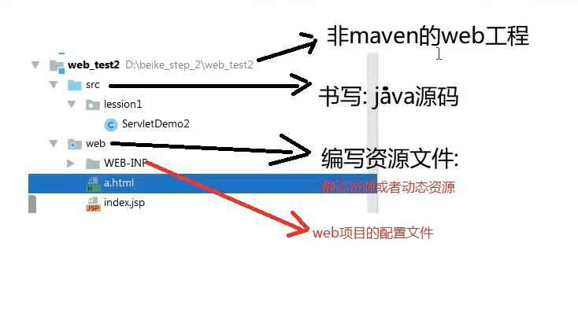
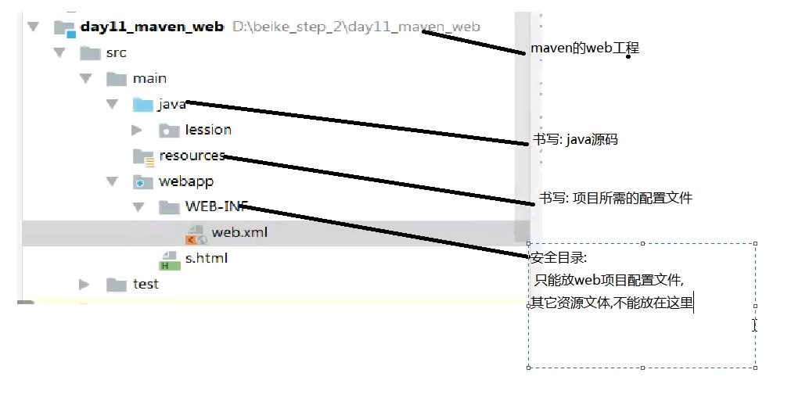
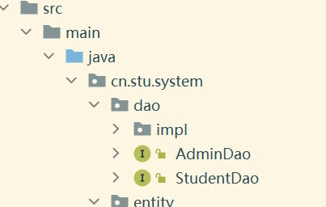
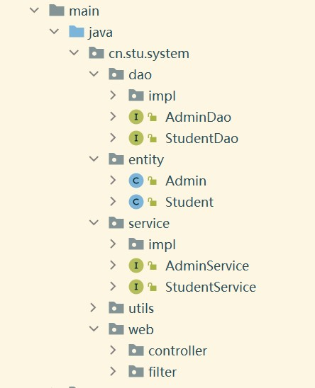
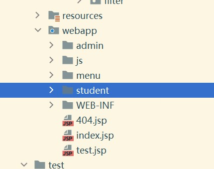

# web项目的目录结构

## web普通项目的目录结构

## webmaven项目的目录结构

## 三层结构中的目录结构

# web项目的创建
## 普通项目
    步骤一：创建一个普通的javaee项目
    步骤二: 创建一个web目录（在项目栏右键add framework）
    步骤三：在javaee的lib包下添加包（通过file 的project structure实现）
    步骤四：添加tomcat配置（注意部署项目，以及更改访问路径）
    步骤五：在web.xml文件中添加servlet映射或在servlet中添加@webservlet（url路径）
## maven项目
    步骤一：创建一个maven项目
    步骤二：创建一个web目录
    步骤三：在pom.xml里添加packaging标签：添加tomcat插件(注意更改里面的路径)
            添加相应的依赖
    步骤四：在run项里配置tomcat 方法栏里写对应的插件run方法
## 数据库和前端连接的步骤:
    步骤一：定义一个JDBCUtil类用来获取连接对象
    步骤二：定义一个servlet里面写相应的sql语句
    步骤三：写前端页面，将相应的get或post方法添加到method属性中
# 项目实战：

    步骤：

        步骤一：
            创建maven的web项目
            
        步骤二：
            引入依赖
            指定编译的整体环境
        步骤三：
            根据javaee三层架构分层开发：
                划分包结构：
                web（交互）：servlet，filter等controller模式对应技术
                service：存放业务类
                dao：存放持久层（Spring-jdbc）
                utils：存放工具类
                entity（pojo，domain）：存放javabean类
            面向接口开发：
            接口最大优点：
            解耦合（类之间的关系，或者父与子之间的关系），
            易于扩展
            adminService as = new adminservice（）；直接耦合，后期开发要避免
            adminservice as2 = new adminservicerimpl()父与子耦合也要避免
            解决耦合：使用bean容器（工厂模式+配置文件）解决
        步骤四：
            导入页面原型（前端提供）
                 将页面放在webapp下面
## web三层结构：
        web层：（表现层）
            servlet和controller模式对应的技术（获取前端数据）（实现页面请求数据封装到Bean对象）           
        service层：（业务逻辑层）：
            进行逻辑判断，数据库数据到Bean对象实现逻辑判断
            事务管理所处的层次
            可以进行多张表的操作
            减少代码冗余
        dao层:（持久层）：
            Spring-jdbc实现，通过sql对象实现增删改查
    建立三层架构注意事项：
        对数据进行封装时要注意将Bean对象和前端属性值一一映射
        方法参数是从三层架构上层往下传值
        返回值是从三层架构由下往上传值

    javaBean对象的封装步骤：
        （当用户向后台发送请求时进行数据的封装）
        1.获取用户请求数据
        Map<String,String[]> map =request.getParameterMap();
        2.创建一个javaBean对象
        Student student = new Student();
        3.调用BeanUtils工具类对数据进行封装：
        BeanUtils.populate(student,map);
    使用Spring-jdbc持久层框架进行
        步骤一：
            导入所需的依赖
        步骤二：
            创建核心对象jdbcTemplate
        JdbcTempalate jabctemplate = new JdbcTempalate(JDBCutils.getDataSource());
        步骤三：
             执行查询：
            jdbctempalate.update|query|queryForObject|queryForList
                查询所有：
                LIst<T> list = jt.query(sql,结果处理器，参数)
                查询一个javabean
                T t = jt.queryforobject(sql,结果处理器，参数)
                查询一列数据
                    list<列的类型> list = queryforlist（）
                查询聚合函数
                查询的参数：（sql语句,new BeanPropertyRowMapper<返回的类对象的类型>（类的名字），sql语句中的参数）

## jdbc的使用：

    ${}EL表达式
    ${adminname}通过servlet的域对象的setAttribute()
    通过标签里的name属性，和javaBean对象的属性值进行对应传值，后端通过getparameterMap()获取对应的请求数据

### jstl标签库的使用
    首先将类依赖导入pom.xml文件
    在jsp文件中添加
    <%@ taglib uri="http://java.sun.com/jsp/jstl/core" prefix="c" %>

    <c:forEach items = "list" var = "lists"></c:forEach>
    可以通过items往后台传请求数据对象
    通过var变量属性来遍历传入的list集合

    通过if属性来达到页面有选择显示的效果
    			<c:if test="${empty adminname}">
					<li><a href="login.jsp" target="_blank">登录</a></li>
					<li><a href="regist.jsp" target="_blank">注册</a></li>
					</c:if>
					<c:if test="${not empty adminname}">
						<li><a href="/LogOutServlet" target="_blank">退出</a></li>
					</c:if>

    @webservlet("")里面的路径值就是url可以给input的href属性赋值

    <a href="${pageContext.request.contextPath}/EditStudentInfoServlet?sid=${list.sid}">编辑</a>
    可以通过url路径的请求体来给后台传当前数据条的主键，以为后台提供对应的sql语句参数

    点击按钮即是一次请求，通过form的action属性来进行跳转，
    通过form里面的method方法来识别调用的servlet的方法

    标签的隐藏：
    方法一：设置 style ="display:none"
        <td><input type = "text" style ="display:none" name = "bookid" value="${param.bookid}"></td>
    方法二：设置 style="visibility:hidden"
        <td><input type = "text" style="visibility:hidden" name = "bookid" value="${param.bookid}"></td>

    标签之只读属性：readonly="readonly"
## 跳转和重定向
    跳转：
        request.getRequestDispatcher("/student/editCustomer.jsp").forward(request,response);
    重定向：
       response.sendRedirect("/StudentQueryServlet");
## Servlet中的四个域对象
## Date类型和String类型数据的转换：

    //将Date数据类型的日期转换为String类型的数据（浏览器中的数据都是String类型）
        SimpleDateFormat sf = new SimpleDateFormat("yyyy-MM-dd");
        String date = String.format("%tF",student.getRegisterTime());
    //将String类型的数据类型封装到Bean对象中：
        DateConverter converter = new DateConverter();
        converter.setPattern(new String("yyyy-MM-dd"));
        ConvertUtils.register(converter, Date.class);
## 模块化设计
    通过模块设计来减少代码的冗余度，和复杂度
    有几个模块（例如用户）来定义几个对应层的接口
    在接口中写需要调用的方法
            
## 注意：
    浏览器中的数据都是String类型
