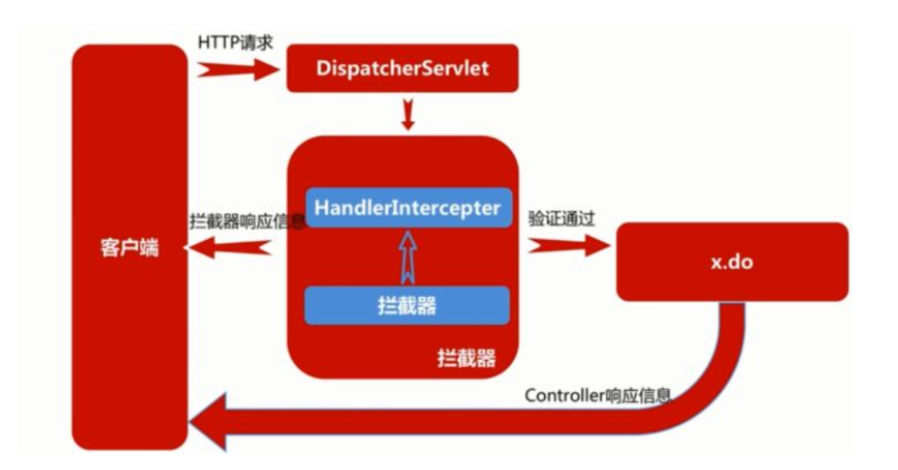

## 自定义拦截器
### 拦截器执行流程

### 三个方法执行时机
    prehandle（在controller执行之前执行）
        boolean
        true ,表示还会执行下一个拦截器的prehandle
        flase，表示请求结束，后面的拦截器和controller都不会执行
    postHandle(在controller执行之后执行)
    afterCompletion（在controller执行之后和在未提交到视图解析器之前执行）
### 实现步骤
步骤一：自定义一个拦截器类，实现拦截器规范
步骤二:在mvc配置文件中对其进行配置
步骤三：定义一个controller测试类
### 代码
步骤一:
~~~~java
package com.interceptor;

import org.springframework.lang.Nullable;
import org.springframework.web.servlet.HandlerInterceptor;
import org.springframework.web.servlet.ModelAndView;

import javax.servlet.http.HttpServletRequest;
import javax.servlet.http.HttpServletResponse;
//自定义拦截器
public class TestInterceptor implements HandlerInterceptor {
    public boolean preHandle(HttpServletRequest request, HttpServletResponse response, Object handler) throws Exception {
        String name = handler.getClass().getName();
        System.out.println(name);
        System.out.println("在controller方法前执行");
        return true;
    }

    public void postHandle(HttpServletRequest request, HttpServletResponse response, Object handler, @Nullable ModelAndView modelAndView) throws Exception {
        System.out.println("在controller方法后执行");
    }

    public void afterCompletion(HttpServletRequest request, HttpServletResponse response, Object handler, @Nullable Exception ex) throws Exception {
        System.out.println("在提交到spring中央控制器后，在提交到视图解析器之前执行");
    }
}

~~~~
步骤二：
~~~~xml
    <!--配置拦截器-->
    <mvc:interceptors>
        <mvc:interceptor>
            <!--配置拦截路径-->
            <mvc:mapping path="/test"/>
            <!--配置自定义拦截器bean对象-->
            <bean class="com.interceptor.TestInterceptor"/>
        </mvc:interceptor>
    </mvc:interceptors>
~~~~
步骤三:
~~~~java
package com.controller;

import org.springframework.stereotype.Controller;
import org.springframework.web.bind.annotation.RequestMapping;

@Controller
public class TestInterceptorWithController {
    @RequestMapping("/test")
    public void test1(){
        System.out.println("这是controller执行方法");
    }
}
~~~~