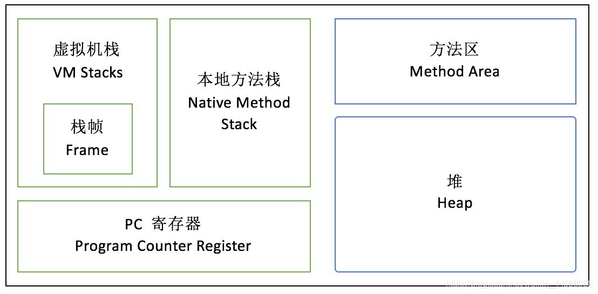
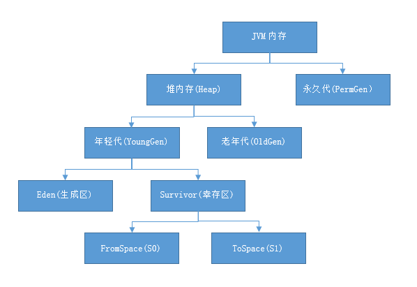
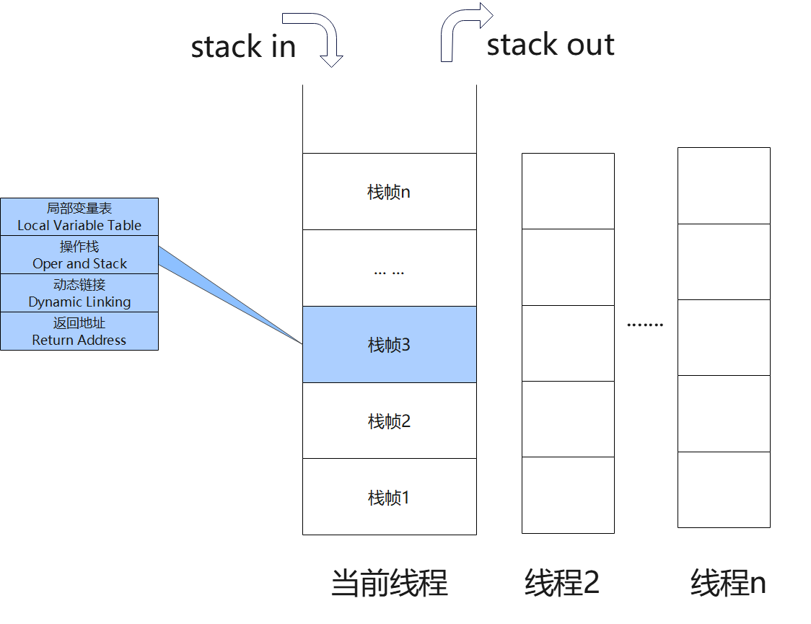

[TOC]
# java存储结构

## 堆和栈分别存储：
    
         
    栈内存：horse = new Horse();申请一个栈内存空间
        存储变量名和地址（存储引用数据类型的引用）（除了基本类型其他都是引用数据类型）
    
    
    堆内存：存储new出来的对象
    方法区（静态区）：存储在堆内存当中，用于存放
        1.代码的基本信息
        2.方法和静态变量
        3.常量池
    （实例变量）只能被对象调用（对象的特有数据）
        （非静态变量）在堆中（方法区）
    静态变量：可以被对象调用还可被类名调用
        （类变量）存储在方法区（静态区）（对象的共享数据）
## 一、堆内存

### 1.1堆分代：
    堆式java中，java内存中最大的一片区域，内存中垃圾回收使用最频繁的区域，使用堆分代可以提高内存的分配效率和圾回收的效率
    
    垃圾回收其中主要存在于新生代（当eden区域满时触发(Minor GC：清理年轻代)）（一般存放新创建的对象eden区、from区和to区（survive区域））
    经历多次MInor仍然存活的转入老年代中
        和老年代（Major GC（清理老年代）  生命周期比较长的对象），当占满触发Major GC== Full GC时清理所有代包括老年代和年轻代，所有GC都会停止应用所有线程
    
    永久代： 一般存放静态变量、常量和类信息JDK
            jdk1.8中已经被元空间所替代
        元空间：大部分数据在本地保存，与堆共享内存空间

    一个对象的这一辈子：  
        我是一个普通的java对象，我出生在Eden区，在Eden区我还看到和我长的很像的
        小兄弟，我们在Eden区中玩了挺长时间。有一天Eden区中的人实在是太多了，我就
        被迫去了Survivor区的“From”区，自从去了Survivor区，我就开始漂了，有时候
        在Survivor的“From”区，有时候在Survivor的“To”区，居无定所。直到我18岁
        时候，爸爸说我成人了，该去社会上闯闯了。于是我就去了年老代那边，年老代\
        里，人很多，并且年龄都挺大的，我在这里也认识了很多人。在年老代里，我生活
        了20年(每次GC加一岁)，然后被回收。
## 二、元空间
    和堆共享内存空间
    方法存放在其中
## 三、本地方法栈和方法区的区别
    本地方法栈的线程是私有的
    方法区的线程是共享的存储类的结构信息
## 四、程序计数器（pc寄存器）
    每个线程都有一个程序计数器，是线程私有的
    是记录当前线程所执行字节码的行号指示器
## 五、java虚拟机栈
    1.java虚拟栈是线程私有的，与线程同时创建
    2.栈帧：
        存储局部变量表（容量以变量槽为基本单位）
        （static方法在变量表中无this参数 实例方法有this参数），
            操作数栈，
            动态链接，返回地址
        返回地址：方法返回必须有返回指令或异常终止

    3.栈的容量在线程创建时就已经确定
    4.java虚拟机是以方法为基本单位的

## 变量：
    局部变量在栈中保存
    成员变量在堆中保存