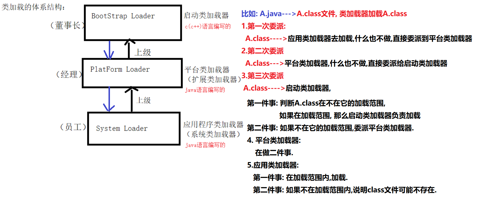

- [类的加载器](#类的加载器)
  - [类加载器的分为三类 extension](#类加载器的分为三类-extension)
- [类的加载顺序：](#类的加载顺序)
  - [Object类的默认方法：](#object类的默认方法)
- [内部类](#内部类)
  - [分类：成员内部类，局部内部类，静态内部类，匿名内部类，](#分类成员内部类局部内部类静态内部类匿名内部类)
  - [内部类的作用：](#内部类的作用)
  - [成员内部类和局部内部类的区别：](#成员内部类和局部内部类的区别)
  - [匿名内部类](#匿名内部类)
  - [静态内部类：](#静态内部类)
  - [类的修饰符：](#类的修饰符)
  - [子类和父类：](#子类和父类)
    - [子类的实例方法和父类的实例方法：](#子类的实例方法和父类的实例方法)
    - [super变量：](#super变量)
  - [类之间存在的几种常见关系：](#类之间存在的几种常见关系)
  - [抽象类和接口：](#抽象类和接口)
  - [加载顺序](#加载顺序)
    - [继承加载顺序：](#继承加载顺序)
    - [接口和抽象类的](#接口和抽象类的)
    - 
    - 

# 类的加载器
* 第一类加载器: 启动类加强(或者引用类加载器) (最顶层)

* 第二类加载器: 扩展加载器(或者平台类加载器)(中层)

* 第三类加载器: 应用类加载器(或者系统类加载器)(下层)

* 如图:

## 类加载器的分为三类 extension

- Bootstrap class loader：它是虚拟机的内置类加载器(启动或者引导类加载器)，通常表示为null ，并且没有父null

  负责 : JDK下面的rt.jar里面的所有class文件的.

- Platform class loader：平台类加载器可以看到V V3所有平台类(扩展类加载器) ，平台类包括由平台类加载器或其祖先定义的Java SE平台API，其实现类和JDK特定的运行时类

  负责: JDK下面ext目录: 所有jar里面的class文件

- System class loader：它也被称为应用程序类加载器 (系统类加载器)，与平台类加载器不同。 系统类加载器通常用于定义应用程序类路径，模块路径和JDK特定工具上的类

  负责: 负责加载程序员自己的类.

- 类加载器的继承关系：System的父加载器为Platform，而Platform的父加载器为Bootstrap

- 代码如下;

~~~~java
   public static void main(String[] args){
          //启动类加载器: rt.jar里面都是class:  String.class, 由启动类加载器(c语言写的)
          ClassLoader boot = String.class.getClassLoader();
          System.out.println(boot);//null
          //扩展类加载器: ext目录:
          ClassLoader plat = LocaleNames_zh.class.getClassLoader();
          System.out.println(plat);
          //应用类加载器: 自定义类
          ClassLoader app = Demo1.class.getClassLoader();
          System.out.println(app);
      }
~~~~

    《深入理解Java虚拟机》P228：对于任意一个类，都需要由加载它的类加载器和这个类本身一同确立其在Java虚拟机中的唯一性，
        每一个类加载器，都拥有一个独立的类名称空间。这句话可以表达得更通俗一些：比较两个类是否“相等”，
        只有在这两个类是由同一个类加载器加载的前提下才有意义，
        否则，即使这两个类来源于同一个Class文件，被同一个虚拟机加载，只要加载它们的类加载器不同，
        那么这两个类必定不相等。接口类是一种特殊类，因此对于同一接口不同的类装载器装载所获得的类是不相同的。
        
        类只需加载一次就行，因此要保证类加载过程线程安全，防止类加载多次。

        Java程序的类加载器采用双亲委派模型，实现双亲委派的代码集中在java.lang.ClassLoader的loadClass()方法中，
        此方法实现的大致逻辑是：先检查是否已经被加载，若没有加载则调用父类加载器的loadClass()方法，
        若父类加载器为空则默认使用启动类加载器作为父类加载器。如果父类加载失败，抛出ClassNotFoundException异常。
        
        双亲委派模型的工作过程：如果一个类加载器收到了类加载的请求，它首先不会自己去尝试加载这个类，
        而是把这个请求委派给父类加载器去完成，每一个层次的类加载器都是如此，
        因此所有的加载请求最终都应该传送到顶层的启动类加载器中，只有当父加载器反馈自己无法完成这个加载请求时，
        子加载器才会尝试自己去加载。
    
        应用程序类加载器（Application ClassLoader）
        负责加载用户类路径（ClassPath）上所指定的类库，不是所有的ClassLoader都加载此路径。

# 类的加载顺序：
    类的加载顺序：
    父类的静态代码块（只加载一次执行完销毁），静态变量
    子类的静态代码块，静态变量
    父类的成员变量和块赋值
    父类的构造方法
    子类的成员变量和块赋值
    子类的构造方法
    (静态代码块的执行优先级优于主函数)
## Object类的默认方法：
    java object默认的基本方法中没有copy()，含有如下方法：
    getClass(), hashCode(), equals(), clone(), toString(), notify(), notifyAll(), wait(), finalize()
# 内部类
## 分类：成员内部类，局部内部类，静态内部类，匿名内部类，
    class A {
        class B{}

    }

## 内部类的作用：
    可以访问内部类区域定义的私有属性

## 成员内部类和局部内部类的区别：
    成员内部类可以无条件访问外部类的成员属性和成员方法
    局部内部类不能有private、public、protected和static等修饰符，与局部变量类似。
    成员内部类直接在外部类中，局部内部类在方法体中

    class A {           class A{                  class A {    
        class B{}          public void run(){           class B{}   
                                    class B{}
        }                   }                             public static class DoWork implements Work{}
    }                      }                       }
    //成员内部类           //局部内部类             //静态内部类
    //直接在类中           //在类中的方法体中        //有static修饰
    
## 匿名内部类
    匿名内部类没有定义类名，在使用的地方直接定义对象
    是局部类的特例化
    是唯一没有构造方法的类
    不能存在任何静态变量和方法
    大部分用于接口

## 静态内部类：
    不能直接访问外部类的非静态方法和属性，
    在成员内部类的基础上加上static变成静态内部类
    不依赖于外部类

## 类的修饰符：
    外部类的修饰符：
    public，abstract，final，default
    局部内部类的修饰符：
    只能是final
    成员局部类：
    可以用public，private，protected修饰
## 子类和父类： 
    子类和父类在加载时优先加载父类
### 子类的实例方法和父类的实例方法：
    子类的实例方法对父类不可见，所有无法直接调用，只能创建子类的一个实例对象进行调用
    如果超类的实例方法没有在子类中被重写，可以直接被调用，超类的实例方法不能直接调用，只能通过实例化超类进行调用
    实例方法可以调用本类的实例方法  
### super变量：
    提供了对父类的访问，
    提供了对父类隐藏属性和覆盖方法的方位
    每个子类的第一句都会默认调用父类的构造方法通过（super（）隐式）
## 类之间存在的几种常见关系：
    USES-A：
    依赖关系，A类会用到B类，这种关系具有偶然性，临时性。但B类的变化会影响A类。
            这种在代码中的体现为：A类方法中的参数包含了B类。
            关联关系：A类会用到B类，这是一种强依赖关系，是长期的并非偶然。在代码中的表现为：A类的成员变量中含有B类。
    HAS-A：（整体和部分的关系）
    聚合关系，拥有关系，是关联关系的一种特例，是整体和部分的关系。
    比如鸟群和鸟的关系是聚合关系，鸟群中每个部分都是鸟。
    IS-A：
    表示继承。父类与子类，这个就不解释了。
    要注意：还有一种关系：组合关系也是关联关系的一种特例，它体现一种contains-a的关系，这种关系比聚合更强，也称为强聚合。它同样体现整体与部分的关系，但这种整体和部分是不可分割的。

    类加载器中优先加载静态定义的方法和代码块，如果都是静态的按顺序执行

    is assignable to 是前者是后者的子类
##  抽象类和接口：
    抽象类
    特点:
    1.抽象类中可以构造方法
    2.抽象类中可以存在普通属性，方法，静态属性和方法。
    3.抽象类中可以存在抽象方法。
    4.如果一个类中有一个抽象方法，那么当前类一定是抽象类；抽象类中不一定有抽象方法。
    5.抽象类中的抽象方法，需要有子类实现，如果子类不实现，则子类也需要定义为抽象的。

    接口
    1.在接口中只有方法的声明，没有方法体。
    2.在接口中只有常量，因为定义的变量，在编译的时候都会默认加上
    public static final 
    3.在接口中的方法，永远都被public来修饰。
    4.接口中没有构造方法，也不能实例化接口的对象。
    5.接口可以实现多继承
    6.接口中定义的方法都需要有实现类来实现，如果实现类不能实现接口中的所有方法
    7.则实现类定义为抽象类。

      抽象类
        特点:
        1.抽象类中可以构造方法
        2.抽象类中可以存在普通属性，方法，静态属性和方法。
        3.抽象类中可以存在抽象方法。
        4.如果一个类中有一个抽象方法，那么当前类一定是抽象类；抽象类中不一定有抽象方法。
        5.抽象类中的抽象方法，需要有子类实现，如果子类不实现，则子类也需要定义为抽象的。
        6,抽象类不能被实例化，抽象类和抽象方法必须被abstract修饰

        关键字使用注意：
        抽象类中的抽象方法（其前有abstract修饰）不能用private、static、synchronized、native访问修饰符修饰。

    接口
        1.在接口中只有方法的声明，没有方法体。
        2.在接口中只有常量，因为定义的变量，在编译的时候都会默认加上public static final
        3.在接口中的方法，永远都被public来修饰。
        4.接口中没有构造方法，也不能实例化接口的对象。（所以接口不能继承类）
        5.接口可以实现多继承
        6.接口中定义的方法都需要有实现类来实现，如果实现类不能实现接口中的所有方法则实现类定义为抽象类。
        7，接口可以继承接口，用extends
        

        接口可以实现多继承
        抽象类不能多继承
##  加载顺序
    先加载类文件：
    
    先加载父类文件，再加载子类的类文件
            类种类文件加载顺序：
            先加载声明：
            只加载静态成员变量的声明，不加载静态成员的声明；
            只加载声明不加载值，无论其声明是否赋值
            不加载静态代码块中的变量
            静态代码块和非静态代码块相当于方法，{}里面的内容相当于方法体代码
    
    执行main方法：
        main方法中的代码块，按顺序执行
        执行new对象时，
            先访问父类的构造方法，再访问子类的构造方法
            访问构造方法时

### 继承加载顺序：
     父类静态变量
     父类静态代码块
     子类静态变量
     子类静态代码块
     父类非静态代码块
     父类构造方法
     子类非静态代码块
     子类构造方法

     类的加载顺序：
    类名
    类的属性
    类的方法
    类的构造方法

### 接口和抽象类的
    相同点：
        接口和抽象类中都有抽象方法
        两个都不能创建对象
        两者区别：
        抽象类：什么都可以定义，
                子类只能继承一个抽象类
                用abstract修饰
                子类实现方式：extends、
                抽象类中可以有抽象方法也可没有
                抽象方法必须使用public修饰
                对子类的共同属性和行为进行抽取
        接口：暂时只能定义常量和抽象方法
                子类可以实现多个接口
                用interface修饰
                子类实实现方式：implements
                接口里面都是抽象方法
                常量和抽象方法必须使用public修饰
                对子类特定行为进行约束
### 
    根据以下代码段，下列说法中正确的是(    )。

    public class Parent {
        private void m1(){}
        void m2(){}
        protected void m3(){}

        public static void m4(){}

    }

    通过继承，子类可以拥有所有父类对其可见的方法和域

    A.私有方法只能在本类中可见，故不能继承，A错误
    B.缺省访问修饰符只在本包中可见，在外包中不可见，B错误
    C.保护修饰符凡是继承自该类的子类都能访问，当然可被继承覆盖；C正确
    D.static修饰的成员属于类成员，父类字段或方法只能被子类同名字段或方法遮蔽，不能被继承覆盖，D错误
### 
    class Car extends Vehicle
    {
        public static void main (String[] args)
        {
            new  Car(). run();
        }
        private final void run()
        {
            System. out. println ("Car");
        }
    }
    class Vehicle
    {
        private final void run()
        {
            System. out. println("Vehicle");
        }
    }
    首先final声明的方法是不能被覆盖的，但是这里并不错误，因为方法是private的，也就是子类没有继承父类的run方法，因此子类的run方法跟父类的run方法无关，并不是覆盖。new Car().run()也是调用子类的run方法。
    