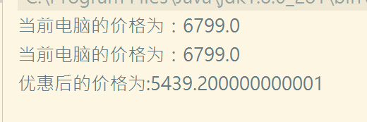
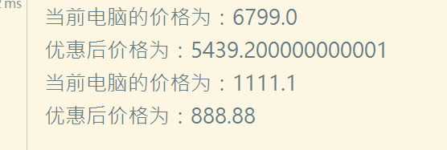

## CGlib使用步骤：
    步骤0：导入依赖
    步骤一：创建一个需要被代理的类
    步骤二：创建一个类去实现MethodIntercepter接口（）
        为后续的创建代理对象提供方法拦截器参数(也可通过匿名内部类的形式提供参数)
    步骤三：创建一个获取代理对象的类
        实现步骤：
            步骤一:
                创建一个动态代理对象增强类（Enhancer）
            步骤二:
                设置参数
                    设置类加载器参数
                    设置被代理类对象
                    设置目标类方法拦截器
            步骤四；
                创建代理对象
## 代码实现:
### 依赖导入
~~~~xml
    <dependency>
          <groupId>cglib</groupId>
          <artifactId>cglib</artifactId>
          <version>3.2.0</version>
      </dependency>
~~~~
### 创建一个需要被代理的类
~~~~java 
package homework;
//创建一个
public class MyHuaWei {
    public void getPrice(Double price){

        System.out.println("当前电脑的价格为："+price);
    }

}
~~~~
### 创建一个获取代理对象的类
~~~~java
package homework;

import net.sf.cglib.proxy.Enhancer;
import net.sf.cglib.proxy.MethodInterceptor;
import net.sf.cglib.proxy.MethodProxy;
import org.objectweb.asm.Type;

import java.lang.reflect.Method;

public class MyHuaWeiProxy {
    public static <T>T getProxy(Class<T> clz){
        //获取代理对象的步骤
        //创建一个代理增强对象
        Enhancer enhancer = new Enhancer();
        //设置参数
        //设置类加载器
        enhancer.setClassLoader(clz.getClassLoader());
        //设置被代理类
        enhancer.setSuperclass(clz);
        //设置拦截器
        enhancer.setCallback(new MethodInterceptor() {
            @Override
            public Object intercept(Object o, Method method, Object[] objects, MethodProxy methodProxy) throws Throwable {
                //使用被拦截方法调用原始方法
                method.invoke(clz.newInstance(),objects);
                //method实际类的代理引用，比原始方法method调用效率要高
                Object invoke = methodProxy.invokeSuper(o, objects);
                Double d  = (Double) objects[0];
                System.out.println("优惠后的价格为:"+d*0.8);
                return  invoke;
                }
        });
        return (T) enhancer.create();
    }
}
~~~~
### 创建一个测试类
~~~~java

import homework.MyHuaWei;
import homework.MyHuaWeiProxy;
import org.junit.Test;

public class HomeworkTest {
    @Test
    public void test1(){
        MyHuaWei proxy =  MyHuaWeiProxy.getProxy(MyHuaWei.class);
        proxy.getPrice(6799.0);

    }

}

~~~~
### 结果

## 动态代理
    步骤一：创建一个接口
    步骤二：创建一个实现类实现接口 
    步骤三: 创建一个获取代理对象的类         
### 创建一个接口
~~~~java
public interface MyHuaWei {
    void getPrice(Double price);
}

~~~~
### 创建一个实现类
~~~~java
public class MyHuaWeiImpl implements MyHuaWei{
    @Override
    public void getPrice(Double price) {

            System.out.println("当前电脑的价格为："+price);

    }
}
~~~~
### 获取代理对象：
#### 使用实例化对象获取
~~~~java
import org.springframework.cglib.proxy.Enhancer;

import java.lang.reflect.InvocationHandler;
import java.lang.reflect.Method;
import java.lang.reflect.Proxy;

public class ProxyTest <T> {

    public static <T>T getProxy(T clz){
        //获取类加载器对象
        ClassLoader classLoader = clz.getClass().getClassLoader();
        //获取所有接口
        Class[] interfaces = clz.getClass().getInterfaces();
        //获取Invocationhandler
        InvocationHandler invocationHandler = new InvocationHandler() {
            @Override
            public Object invoke(Object proxy, Method method, Object[] args) throws Throwable {
                Object invoke = method.invoke(clz, args);
                Double d  = (Double) args[0];
                System.out.println("优惠后价格为："+d*0.8);
                return invoke;
            }
        };
        return (T) Proxy.newProxyInstance(classLoader,interfaces,invocationHandler);
    }

}
~~~~
#### 传入实现类来获取
~~~~java
import org.springframework.cglib.proxy.Enhancer;

import java.lang.reflect.InvocationHandler;
import java.lang.reflect.Method;
import java.lang.reflect.Proxy;

public class ProxyTests <T> {

    public static <T>T getProxy(Class<T> clz){
        //获取类加载器对象
        ClassLoader classLoader = clz.getClassLoader();
        //获取所有接口
        Class[] interfaces = clz.getInterfaces();
        //获取Invocationhandler
        InvocationHandler invocationHandler = new InvocationHandler() {
            @Override
            public Object invoke(Object proxy, Method method, Object[] args) throws Throwable {
                Object invoke = method.invoke(clz.newInstance(), args);
                Double d  = (Double) args[0];
                System.out.println("优惠后价格为："+d*0.8);
                return invoke;
            }
        };
        return (T) Proxy.newProxyInstance(classLoader,interfaces,invocationHandler);
    }

}
~~~~
### 创建一个测试类：
~~~~java
import org.junit.Test;

public class Homework {
    @Test
    public void test1(){
        MyHuaWei proxy = (MyHuaWei) ProxyTest.getProxy(new MyHuaWeiImpl());
        MyHuaWei proxy1 = (MyHuaWei) ProxyTests.getProxy(MyHuaWeiImpl.class);
        proxy.getPrice(6799.0);
        proxy1.getPrice(1111.1);
    }

}
~~~~
### 结果

