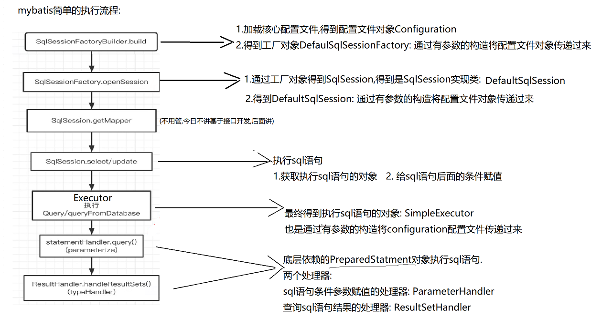

# Mybatis 
## 1.mybatis持久层框架
    mybatis的概念：
    是一个优秀的持久层框架，它的前身时ibatis框架
    官网介绍：
    通过xml或注解来配置和映射原始类型、接口和java pojo为数据库中的记录
## mybatis入门使用：
    步骤一：导入依赖，mysql依赖和mybatis依赖
    步骤二：创建mybatis核心配置文件：配置自带的数据库连接池
    步骤三： 创建mybatis的映射文件:  1. 可以配置sql语句   2. 将javaBean与数据库的数据表建立映射关系.
# 代码：
## 步骤一：将所需依赖导入到pom配置文件
~~~~XML
<project xmlns="http://maven.apache.org/POM/4.0.0" xmlns:xsi="http://www.w3.org/2001/XMLSchema-instance"
  xsi:schemaLocation="http://maven.apache.org/POM/4.0.0 http://maven.apache.org/maven-v4_0_0.xsd">
  <modelVersion>4.0.0</modelVersion>
  <groupId>org.example</groupId>
  <artifactId>MybatisProject</artifactId>
  <packaging>war</packaging>
  <version>1.0-SNAPSHOT</version>
  <name>MybatisProject Maven Webapp</name>
  <url>http://maven.apache.org</url>
  <dependencies>
    <!-- 测试依赖-->
    <dependency>
      <groupId>junit</groupId>
      <artifactId>junit</artifactId>
      <version>4.13.2</version>
      <scope>test</scope>
    </dependency>
    <!-- mysql依赖-->
    <dependency>
      <groupId>mysql</groupId>
      <artifactId>mysql-connector-java</artifactId>
      <version>8.0.30</version>
    </dependency>
    <!-- mybatis依赖   -->
    <!-- https://mvnrepository.com/artifact/org.mybatis/mybatis -->
    <dependency>
      <groupId>org.mybatis</groupId>
      <artifactId>mybatis</artifactId>
      <version>3.5.10</version>
    </dependency>
     <!--log4j日志依赖-->
      <dependency>
          <groupId>log4j</groupId>
          <artifactId>log4j</artifactId>
          <version>1.2.17</version>
      </dependency>
      <!--lombok依赖-->
    <dependency>
      <groupId>org.projectlombok</groupId>
      <artifactId>lombok</artifactId>
      <version>1.18.24</version>
    </dependency>
    <!--jsp依赖-->
     <dependency>
        <groupId>javax.servlet.jsp</groupId>
        <artifactId>javax.servlet.jsp-api</artifactId>
        <version>2.3.3</version>
        <scope>provided</scope>
        </dependency>
      <!--servlet依赖-->
    <dependency>
        <groupId>javax.servlet</groupId>
        <artifactId>javax.servlet-api</artifactId>
        <version>4.0.1</version>
        <scope>provided</scope>
    </dependency>
  </dependencies>
  <build>
    <finalName>MybatisProject</finalName>
  </build>
</project>
~~~~

## 步骤二：对mybatis-config.xml文件进行配置
~~~~XML
<?xml version="1.0" encoding="UTF-8" ?>
<!DOCTYPE configuration
        PUBLIC "-//mybatis.org//DTD Config 3.0//EN"
        "http://mybatis.org/dtd/mybatis-3-config.dtd">
<configuration>
    <!--将log4j.properties文件导入-->
    <properties url="log4j.properties"/>
    <settings>
        <!--标准日志工厂实现-->
        <!--<setting name="logImpl" value="STDOUT_LOGGING"/>-->
        <!---Log4j工厂实现-->
        <setting name="logImpl" value="LOG4J"/>
    </settings>
        <!-- 使用xml文件对Mybatis核心文件进行配置  -->
    <environments default="development">
        <environment id="development">
            <transactionManager type="JDBC"/>
            <dataSource type="POOLED">
                <property name="driver" value="com.mysql.cj.jdbc.Driver"/>
                <property name="url" value="jdbc:mysql://localhost:3306/test2"/>
                <property name="username" value="root"/>
                <property name="password" value="xxxx"/>
            </dataSource>
        </environment>
    </environments>
    <mappers>
    <!--书写映射配置文件，sql语句配置文件-->
        <mapper resource="StudentMapper.xml"/>
    </mappers>
</configuration>
~~~~
方法二：
    使用配置文件对核心文件进行配置
    dp.properties文件中存储相应的数据库连接文件，value的内容和dp文件的key一致
    <properties resource="db.properties"/>
        <!-- 使用xml文件对Mybatis核心文件进行配置  -->
    <environments default="development">
        <environment id="development">
            <transactionManager type="JDBC"/>
            <dataSource type="POOLED">
                <property name="driver" value="${driverClassName}"/>
                <property name="url" value="${url}"/>
                <property name="username" value="${username}"/>
                <property name="password" value="${password}"/>
            </dataSource>
        </environment>
    </environments>
    <mappers>
## 步骤三：书写sql语句配置文件
~~~~XML
<?xml version="1.0" encoding="UTF-8" ?>
<!DOCTYPE mapper
        PUBLIC "-//mybatis.org//DTD Mapper 3.0//EN"
        "http://mybatis.org/dtd/mybatis-3-mapper.dtd">
<!--书写命名空间-->
<mapper namespace="org.mybatis.example.StudentMapper">
<!--查询方法的书写-->
<!--定义方法的id在dao层被调用时使用-->
<!--书写返回的结果类型，对于Bean对象写其类的相对路径-->
    <select id="student" resultType="entity.Student">
        select * from student where id = #{id};
    </select>
</mapper>
~~~~
## 步骤四：获取工厂对象的方法
~~~~java
package utils;
import org.apache.ibatis.io.Resources;
import org.apache.ibatis.session.SqlSessionFactory;
import org.apache.ibatis.session.SqlSessionFactoryBuilder;
import java.io.IOException;
import java.io.InputStream;

public class Mybatis {
    //加载mybatis配置文件
    static String resource = "mybatis-config.xml";
    static InputStream in =null;
    //获取SqlSessionFactory工厂对象
    public static SqlSessionFactory getSqlSessionFactory() {
        {
            try {
                in = Resources.getResourceAsStream(resource);
            } catch (IOException e) {
                throw new RuntimeException(e);
            }
        }
        SqlSessionFactory sqlSessionFactory = new SqlSessionFactoryBuilder().build(in);
        return  sqlSessionFactory;
    }
}
~~~~
## 步骤五：sql语句的执行
~~~~java
package dao.Impl;
import entity.Student;
import org.apache.ibatis.session.SqlSession;
import utils.Mybatis;

public class StudentInfo  {
    public static Student getStudent() {
//获取执行器对象
        Student student =null;
        SqlSession session = Mybatis.getSqlSessionFactory().openSession();
        try {
            //调用对应的sql语句方法（在配置文件之中）
            student= session.selectOne("org.mybatis.example.StudentMapper.student",1);
        }finally {
            session.close();
    }
        return student;
    }
}
~~~~
## 步骤六：书写测试类
~~~~java
import dao.Impl.StudentInfo;
import entity.Student;

public class Test {
    public static void main(String[] args) {
        Student student=StudentInfo.getStudent();
        System.out.println(student);
    }
}
~~~~
# Mybatis的执行流程

# 源码分析
## MyBatis的api

* Resources资源类

  作用: 获取配置文件的字节输入流, 查询源码发现: 底层利用类加载器获取配置文件的 字节输入流

  ~~~~java
     InputStream in= Resources.getResourceAsStream("mybatis-config.xml");
  ~~~~

* SqlSessionFactoryBuilder 类, 构建器对象

  作用: 加载mybatis的核心配置文件,获取一个配置对Configuration(配置文件)

  ~~~~~java
  //1.创建构建器对象
   SqlSessionFactoryBuilder b = new SqlSessionFactoryBuilder();
  //2.加载核心配置文件的字节输入流, mybatis-config.xml配置文件的数据在哪?
    b.build(in)
  //bulid方法底层源码:利用XMLConfigBuilder加载配置文件, 获取核心配置文件的数据保存到Configuration对象
     XMLConfigBuilder parser = new XMLConfigBuilder(inputStream, environment, properties);    
  ~~~~~

  小结:

  1. mybatis开发中,可以使用配置文件比如: mybatis-config.xml
  2. mybatis开发中,可以使用配置对象Configuration对象,替代配置 mybatis-config.xml

*   SqlSessionFactory (  SqlSession的工厂)接口

  ~~~~~java
  SqlSessionFactory  sqlSession =  bulider.build(in);//DefaultSqlSessionFactory
  源码底层:
  SqlSessionFactory var5;
          try {
              //得到配置文件对象Configuration,保存了核心配置文件的数据
              XMLConfigBuilder parser = new XMLConfigBuilder(inputStream, environment, properties);
              var5 = this.build(parser.parse());
          }
  
  //DefaultSqlSessionFactory源码:
  
  public class DefaultSqlSessionFactory implements SqlSessionFactory {
      private final Configuration configuration;
  	//通过构建器加载配置文件得到工厂对象, 通过有参数的构造方法将配置文件configuration
      public DefaultSqlSessionFactory(Configuration configuration) {
          this.configuration = configuration;
      }
  ~~~~~

* SqlSession接口

1. 获取sqlSession对象的方法

~~~~java
//openSession()里面有参数false, 执行更新操作,事务不会自动提交 ,可以进行事务控制(马上代码演示)
SqlSession sqlSession = factory.openSession();
//SqlSession对象,执行更新操作时,会自动提交事务
SqlSession sqlSession = factory.openSession(true);
~~~~

2. sqlSession里面的方法
   * 查询方法:  selectX(参数)
   * 更新方法:  insert(参数), update(参数), delete(参数)
   * 事务方法: commit(); rollback();
   * 配置文件对象的方法: Configuration getConfiguration();
   *   <T> T getMapper(Class<T> var1):  mybatis基于接口开发,获取接口的代理对象(后面讲)

3. SqlSession接口执行sql语句时,底层依赖的DefaultSqlSession

   **DefaultSqlSession源码**

   ~~~~~java
   public class DefaultSqlSession implements SqlSession {
       private final Configuration configuration;
       private final Executor executor;
       private final boolean autoCommit;
       private boolean dirty;
       private List<Cursor<?>> cursorList;
   
       public DefaultSqlSession(Configuration configuration, Executor executor, boolean autoCommit) {
           this.configuration = configuration;
           this.executor = executor;
           this.dirty = false;
           this.autoCommit = autoCommit;
       }
   
       public DefaultSqlSession(Configuration configuration, Executor executor) {
           this(configuration, executor, false);
       }
   
   ~~~~~

**Executor源码,是一个接口,底层默认使用的SimpleExecutor**
    一个查询更新方法只能调用一次Executor，否则会产生线程争抢问题，

**SimpleExecutor**

* **作用1**: 根据有参数的构造方法传递过来的Configuration,建立与数据库服务器的连接

* **作用2:**  核心配置文件对象Configuration,也加载了映射文件,映射文件数据加载到映射对象MappedStatement

  ​			 首先根据MappedStatement对象获取对应的sql语句, 根据sql语句到执行sql语句对象: **PreparedStatment**

* **作用3:**执行sql语句时, 依赖结果集处理器对象 **ResultSetHandler**(执行查询)和**ParameterHandler**(给sql语句赋值)

~~~~java
public class SimpleExecutor extends BaseExecutor {
    public SimpleExecutor(Configuration configuration, Transaction transaction) {
        super(configuration, transaction);
    }

    public int doUpdate(MappedStatement ms, Object parameter) throws SQLException {
        Statement stmt = null;

        int var6;
        try {
            Configuration configuration = ms.getConfiguration();
            StatementHandler handler = configuration.newStatementHandler(this, ms, parameter, RowBounds.DEFAULT, (ResultHandler)null, (BoundSql)null);
            stmt = this.prepareStatement(handler, ms.getStatementLog());
            var6 = handler.update(stmt);
        } finally {
            this.closeStatement(stmt);
        }

        return var6;
    }
~~~~

**给sql语句的条件赋值的处理器**

~~~~~java
public interface ParameterHandler {
    Object getParameterObject();

    void setParameters(PreparedStatement var1) throws SQLException;
}

~~~~~

**执行查询sql语句,处理查询结果的处理器**

~~~~java
public interface ResultSetHandler {
    <E> List<E> handleResultSets(Statement var1) throws SQLException;

    <E> Cursor<E> handleCursorResultSets(Statement var1) throws SQLException;

    void handleOutputParameters(CallableStatement var1) throws SQLException;
}
~~~~

## 总结：

    注意：一个查询更新方法只能调用一次Executor，否则会产生线程争抢问题，
        在mybatis中#{}是预编译对象占位符，而${}是编译对象占位符

