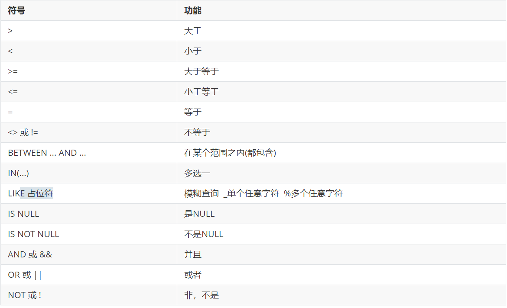
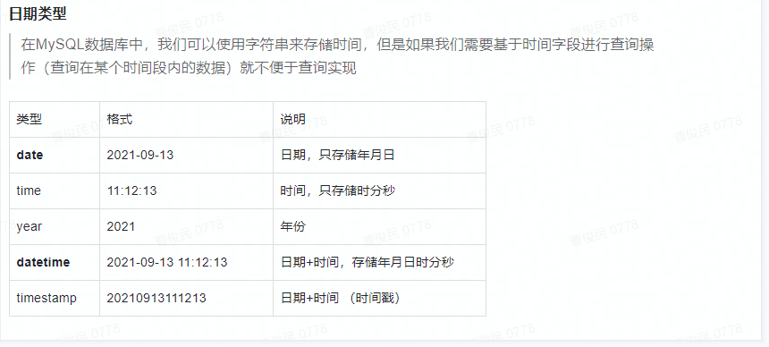
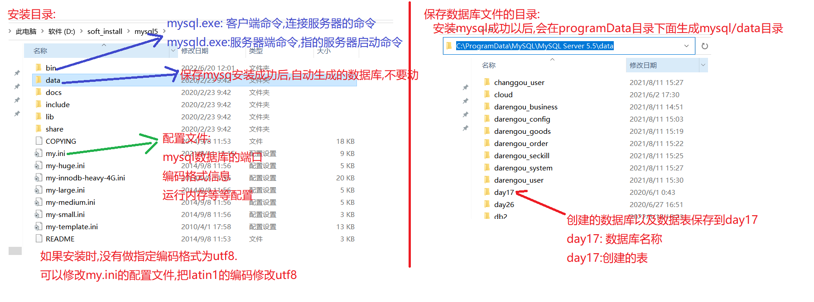
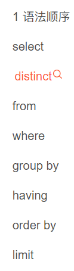
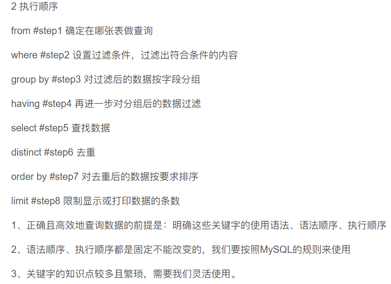
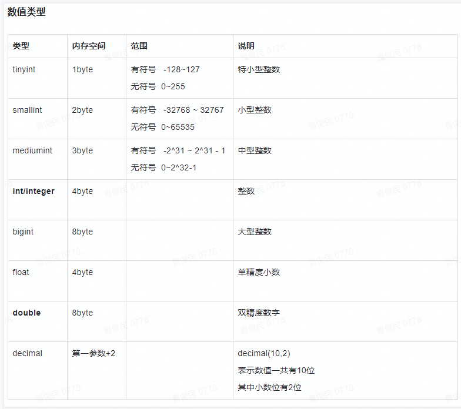
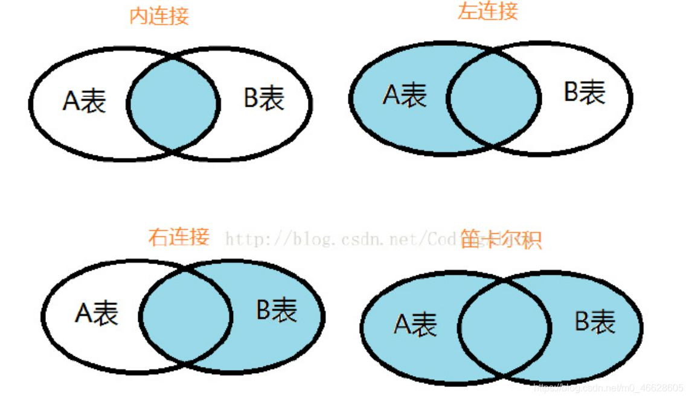

### DDL：操作指令
    创建数据库
    create database 数据库名称；
    create database if not exists 数据库名称；
    修改数据库
    alter database 数据库名称 character set 数据库名称；
    查询数据库
    show databases；
    show create database 数据库名称；
    删除数据库
    drop database 数据库名称；
    drop database if exists 数据库名称；
    切换数据库
    use 数据库名称；
    select database（）；
    查询正在使用的数据库
    ddl操作表：
        用int 整型
        用svarchar 和char类型
    操作表的前提：
        首先确定使用哪个数据库（use）
        在该数据库下操作表
        创建表：
        create table 表的名称（s
            字段名称 字段类型，
            
        ）
        复制表：
        create table 表名 like ‘表名’（这个语句不加）（除数字不加引号其他均加） 
        注意最后一个字段不要有,

        查询表
            desc 表名：查询表结构
            show table ；
            show create table 表名；查询创建表的信息
            show table status like(from) 表名；查询表的详情信息

        删除表
        drop table 表明；
        修改表
        alter table  表名 rename to 新的表名
        character set 修改编码格式
        alter table 表名 add 字段 类型；
        alter table 表名 motify 字段 新的类型；
        alter table 表名 change 原有字段 ，新的字段 类型（可变）；
        alter table 表名 drop 字段名称 ；删除指定的字段
### dml语句
    更新数据
    添加数据的语法格式：
    insert into 表名 values（值1，----值N）；m默认给表的字段添加值，要和字段和类型保证顺序一致       
    insert into 表名（字段一，字段二，字段三） value是（值1，值2，值3）；
    insert into 表名 values（值1，值2），（值1N）；批量插入数据
     insert into 表名（字段一，字段二，字段三） values（值1，值2，值3）， values（值1，值2，值3）；
     删除语句：
     delete from 表名：删除表的所有数据
     delete from 表名 条件；根据指定的条件删除对应数据
     delete *
     面试题：
     delete和truncate删除所有
     delete（dml语句）删除方式是一句一句删除

     truncate（ddl语句）本质:先删除表再创建一个新表（效率高）
     从事务操作来说，delete属于dml有事务操作
     truncate属于ddl语句，没有事务操作
     修改语句的语法格式：
     update 表名 set 字段名称 = 字段值，修改所有字段的值
    update 表名 set 字段名称 = 字段值 where 条件，修改所有字段的值
### DQL语句查询句
    基本查询：
    select * from表名；（很少使用）
    select 字段1，字段2，字段3 from 表名；（不管是否是所有否都用这种）
    去除重复数据，一般情况下某些列的数据可能重复，（distinct）不会出现一行数据重复
    使用关键字distinct语法:select distinct 字段1，字段2 from 表名
    
    分组查询：
    slect 字段信息from 表格group by字段信息；（两个字段信息相同）
    分组:字段信息：具有共性特征，，如果没有共性特征得分组毫无意义
    共性特征：
    商品品牌：
    学生表：班级编号也有共性特征
    
    常见得聚合函数：（聚合函数不能在where后使用）
        作用：统计某列的数据**（如果列的数据为null不参与统计）
        count 统计数量（表中有多少行）
        max 最大值
        min
        sum
        avg
        select count（sid） from tab-stu；
        进行数学运算时null参与，结果为null
        使用if null函数对null值进行解决if null（字段名称，0）
        select classid，count（sid）from tab-stu group by classid；
        as可以改别名可以省略不写加空格
    分页查询
    limit 使用sql方言
    基本语法：
    limit ？，？第一个问好表示分页起始位置第二个问号表示每页数据具有多少条，每页数据条数是固定，除非最后一页数据不够
    第一个？计算规律：（页码数-1）*条数
    排序查询
    order by
    按照一个字段或多个字段进行升序或降序排序
    order by asc（升序）desc（降序）
     order by 字段1 asc， 字段二 asc；默认升序
    条件查询：
        使用关键词：
        where带条件
        模糊like 
        _匹配一个任意字符
        %匹配多个字符
        having分组后判断

### 约束  
    指定约束规则，来保证数据的正确性，完整性，和有效性。
    完整性：通过主键约束保证完整性
    正确性和有效性：学生信息隶属于某个班级，如果学生信息没有班级信息，那么学生信息无效（一般在多表关联中，来规范正确性和有效性）
#### 主键约束的基本语法
   
    基本语法：

    方式一：
    在创建表时，直接在字段后加
    方式二：
    在创建表时在最后一个字段后加
    primary（id）；
    方式三：
    在创建表后，添加主键约束
    alter table tab modify id int primaty key；
    
    删除主键：
    alter drop
    添加主键
    alter add
    ~~~~Sql
    USE gp13;-- 选择要使用的数据库
    CREATE TABLE tab_user1(-- 创建表
        `name` VARCHAR(32) ,
        ptype VARCHAR(32),
        id INT
    );
    DESC tab_user1;-- 显示表结构
    ALTER TABLE tab_user1  DROP PRIMARY KEY;-- 删除主键
    ALTER TABLE tab_user1 MODIFY id INT PRIMARY KEY; -- 创建表后添加主键
    ALTER TABLE tab_user1 ADD   PRIMARY KEY(id); 	-- 添加主键
#### 自增长约束：
    使用自增长的前提
        主键字段才能自增长，
    自增长的特点：
    1.数据不重复
    2.自增长从1开始增长
    3.虽然是自增约束但也需要设置null才会自增
##### 语法
    auto increment
    mysql如果删除后没有查询是否删除保证其效率
    CREATE TABLE tab_user4(
	id INT PRIMARY KEY AUTO_INCREMENT,
	nnn VARCHAR(30) NOT NULL 
    )
    DESC tab_user4;
    ALTER TABLE tab_user4 MODIFY id INT; -- 删除自增长不会删除主键属性
    ALTER TABLE tab_user4 DROP PRIMARY KEY;-- 具有自增长属性的值不能删除主键
    ALTER TABLE tab_user4 MODIFY id INT PRIMARY KEY AUTO_INCREMENT;-- 没有设置主键的添加自增长
    ALTER TABLE tab_user4 MODIFY id INT AUTO_INCREMENT;-- 为主键添加自增长
#### 唯一约束：
    unique
    添加表字段，该字段数据不能重复
##### 语法：
    创建表时，添加唯一约束
    在创建表后添加
    在创建表后删除
    drop index name （唯一约束，约束即为索引）
    CREATE TABLE tab_user2(
	id INT ,
	nnn VARCHAR(30) UNIQUE
    );
    DESC tab_user2;
    ALTER TABLE tab_user2 DROP INDEX  nnn ; -- 删除唯一约束
    ALTER TABLE tab_user2 MODIFY nnn VARCHAR(30) UNIQUE; -- 添加唯一约束
    ALTER TABLE tab_user2 ADD UNIQUE(nnn);   -- 添加唯一约束、
#### 非空约束
##### 语法：
    创建表时
    not null
    创建表后：
    alter modify not null函数对null值进行解决
    删除非空约束：
    不加not null
    CREATE TABLE tab_user3(
	id INT,
	nnn VARCHAR(30) NOT NULL
    )
    DESC tab_user3;
    ALTER TABLE tab_user3 MODIFY nnn VARCHAR(30);-- 删除非空约束
    ALTER TABLE tab_user3 MODIFY nnn VARCHAR(30) NOT NULL;-- 添加非空约束
#### 注意：
    如果一个字段添加了非空约束和唯一约束，虽然符合主键约束特点但不是主键约束

#### 外键约束：
    先有班级表，然后才从学生表中分配信息
    班级表为主表，学生表为从表
    先有谁谁是主表，

    外键一般在从表设计，
##### 外键约束的基本语法：
    外键声明字段：
    创建表时，
    外键字段引入主表的主键值，维护数据，
    constraint 外键约束名称 foreign key（）references 主表名（主键名）；
    创建表后，添加：
    add constraint class_student 
    创建表后，删除外键约束
    alter table tab （从表名） drop foreign key（class_student）
    据外键约束名称删除
##### 特点：
    外键字段必须来源于主表的主键值
    外键字段可以重复
    外键字段的值为null
    外键字段可以有多个
    在创建表后添加外键约束时，如果有数据，一定要清空
    CREATE TABLE t_class(
    cid INT PRIMARY KEY,
    nnn VARCHAR(30)
    )
    ALTER TABLE t_class MODIFY cid INT PRIMARY KEY;
    DESC t_class;
    CREATE TABLE t_student(
        sid INT,
        sname VARCHAR(30),
        sc_id INT,-- 关联主表（主表必须有主键）的外键名称（必须唯一）
    CONSTRAINT csid  FOREIGN KEY(sc_id) REFERENCES	t_class(cid)
    )
    DESC t_student;
    ALTER TABLE t_student DROP FOREIGN KEY csid;-- 删除外键约束
    ALTER TABLE t_student ADD CONSTRAINT csid  -- 添加外键约束
    FOREIGN KEY (sc_id) REFERENCES t_class(cid);
#### 外键级联约束
    级联约束的前提：
    表与表之间有外键约束
    级联操作只针对修改和删除操作有效
    级联修改;修改主表主键，会影响从表的主键值
    级联删除：修改从表的数据时，会删除主表的数据
    级联操作的实际使用：
        比如：
##### 语法：
    创建时添加级联修改
    创建表时添加级联删除
    解决方案：
        根据主表的id把从表的外键字段设为空
        根据主表id删除主表数据
    创建
    on update cascade 级联更新，可以单独使用，（直接在定义外键字段语句之后添加）
    on delete cascade 级联删除，可以单独使用
    删除级联删除和更新直接将外键删除
#### 表的设计
    表的设计分为以下几个阶段：
    第一阶段：
        概念模型设计阶段
                er图：
                    矩形标记实体
                    菱形表示联系
                    椭圆形：实体属性和联系属性
                    实体的属性，要和映射的表的字段一一对应、
    
    第二阶段：
        逻辑设计建模
    第三阶段：
        物理设计（实体建模）
    
    几种关联关系：
    1.一对一关联关系的设计
        外键字段设计原则：
            外键字段可以放在任意一方的表里
            设计一对一的语法：
             方式一：
                在一方表里，添加一个外键字段，关联另一张表的主键
            方式二：
                在一方表里，把该表的主键设置为外键，关联另一张表的主键
    2.一对多：
        一方表的一条数据，对应多方表的多条数据
        一对多的关联关系：
            站在一方表的角度来说：一方表里的一条数据对应多方表的多条数据
            站在多方表的角度来说：多方的一条数据只能属于一方表的一条数据
        一对多的关联关系的语法设计：
            外键字段设计在多方（从表）方便维护，
            一对多的设计语法
        自关联设计：
            领导表和员工表实际开发用一张表来维护信息
            最终维护在一张表中
    3.多对多：
        多表关联存在条件：
            站在多方表的角度来说，一条数据对应另一张表的多条数据
            站在另一个多方表的角度来说，一条数据对应另一张表的多条数据
        本质上就是两个一对多
        设计步骤：
            提供一个中间表：中间表作为主键表
            中间表至少设计两个字段作为联合主键
            中间表的一个字段关联另一个表。另一个字段关联另一个表
    
        如何分清一对多和多对多
        看这个属性是否可以共有（是否为共享资源）
#### 多表查询

##### 笛卡尔积
    多张表放到一起查询，多表查询出现的问题：笛卡尔积
        笛卡尔积介绍：行数相乘 列数相加
    存在的问题：出现冗余数据（称为笛卡尔积）

    如何解决：
    避免笛卡尔的出现，
    where一方表的主键等于多方表的外键值、
##### 内连接查询：（一两张表为例）
    基本语法：
        方式一：
            隐式内连接
            select 字段， from 主表和从表 
            where 主键的主键值= 从表的外键值
        方式二：
            select 字段一，字段 n
            from 主表
            inner join 从表 on 主表的主键值 = 从表的外键值 
        内连接会去除无效数据

##### 外连接查询：
        左外连接：
            基本语法：（一两张表为例）（小到大）
            select from 左表（主表或从表） left[outer] join 右表（从表或主表） on 
        特点：
        查询左表数据，不管是否满足，左表数据全部查询出来，
        右外连接：
        外连接：
        凡是左外连接能实现的查询都可以由右外连接查询
        凡是涉及到查询所有的用外连接查询

##### 子查询
        子查询概念：
        查询中嵌套查询（包含多个select）
        分类：
        第一类：
        作为一个值：
        放在where后面使用 
        第二类：
        子查询作为一个数组'放在where后面使用，通常使用关键字in或exists后面使用（单列多行值）（exits适用于 子查询的数据较多时可以提高效率）
        第三类：
        子查询作为一个表放在from之后（多行多列） 一个新表要重新赋予名字

##### 组合查询
        关键字：union
        联合查询指将多张表连接在一块
        前提：
        多张表的查询字段（列数）要一致
        select sid，sname，，money from tab_subject 
        where college_id< 300

##### 多表查询总结
    自连接：自己表中某个字段需要和自己表中的另一个字段进行匹配
    内连接：合并具有相同一列两个表以上的行，结果集中不包含一个表和另一个表不匹配的行
    外连接：
        左外连接：合并具有相同一列的两个以上的表的行，结果集中除了包含一个表与另一个表匹配的行还查询到左表不匹配的行
    组合连接：
    合并具有相同一列的两个以上的表的行，结果集中除了包含一个表与另一个表匹配的行还查询到左表和右表不匹配的行

    多表查询就是多表合并，通过主键等于外键的方式进行连接，过滤掉无用元素
    
### 事务api对应的方法
    用途：用于批量查询数据

    查询索引的方法
    查询索引：
        select index 
    删除索引删除索引名称：
        alter table student drop index idx_name11;
    添加索引
        alter table student add index name_index（name）；
        create index idx_name11 on student(name);
    删除索引的语法：
        drop index name——index on student
    执行查询
        explain select id，name from id，name where name=；
    查询语句是否使用了索引

    添加索引：
        alter table product add product name_index（name）；
    添加组合索引：
        create index idx_name11 on student(name，age);

    组合索引
    一个索引名称作用于两个字段
    如果匹配不上，一般不会进行全盘扫秒，会使用默认索引算法，匹配一致索引
     
    注意：对于其他数据库组合索引最左匹配规则可能不会生效
     
#### 索引失效问题
    索引失效演示
        失效一：模糊查询索引失效
        失效二： or语句条件里面：没有同时索引会失效，同时使用（前后使用索引）会索引失效
    失效一：
        explain select name.id from student
        where name like '%三';
            explain select name.id from student
        where name = '张三';
    失效二：
            or失效的情况：
        explain select name,id from student
        where name = ’张三‘ or id = 1；

     组合索引
     如果匹配不上，一般不会进行全盘扫秒，会使用默认索引算法，匹配一致索引
     show profiles查询语句的执行语句
     alter table product add product name_index（name）；
     
#### 索引有效率问题
    有索引执行时间会比之前慢
     
     方式一：批量执行多条sql语句
     方式二：执行一条sql语句，批量处理多条数据
     添加五百万条数据

      索引字段越短查询效率越高

    索引长度：
    定义索引长度原则：
        索引的长度的查询接近于表中的总数
            判定方法
            select count（id） from product；
        定义索引的长度：索引具体如何设置长度一般索引长度接近表的长度
            name的名称相同不计算
            使用distinct 
            select count（distinct left（name,10））from product