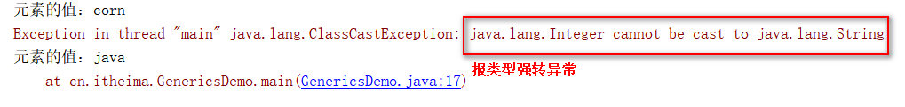
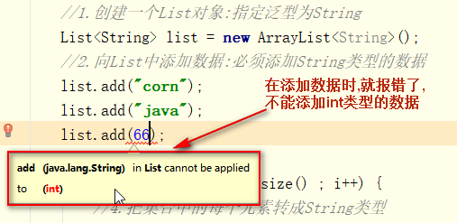

typora-copy-images-to: ./

### 泛型由入门到精通

### 课程导学

Hi，小伙伴你好～欢迎进入**泛型**的学习，在学习之前友情提醒一下：学习**泛型**需要各位小伙伴们具备一定的

javaSE基础，如果之前小伙伴们没有接触过java，大家可以移步到javaSE课程（UI给个链接地址）进行学习。

在正式开始学习之前，我们先来看一段经常书写的代码，分析一下代码存在那些问题？

代码如下：

~~~java
public class GenericsDemo {
    public static void main(String[] args) {
        //1.创建一个List对象
        List list = new ArrayList();
        //2.向List中添加数据
        list.add("python");
        list.add("java");
        list.add(66);
        //3.遍历集合
        for (int i = 0; i <list.size() ; i++) {
            //4.把集合中的每个元素转成String类型
            String ele = (String) list.get(i);
            //5.打印-测试结果
            System.out.println("元素的值："+ele);
        }
    }
}
~~~

**运行代码，会报如下图的异常：**

**那么小伙们，我们来分析一下原因，到底是因为什么报这个异常呢？**

在代码中我们定义了一个List类型的集合，先向其中加入了两个String类型的值，随后加入一个Integer类型的

值。这是完全允许的，因为此时list默认的类型为Object类型，所以在代码编译期间没有任何问题。

但是在运行代码时，<u>由于list集合中既有String类型的值，又有Integer类型的值，致使list集合无法区分值是什么类型，很容易出现上图中</u>

<u>的错误。</u>因为编译阶段正常，而运行时会出现“java.lang.ClassCastException”异常。因此导致此类错误编码过程中不易发现。 

**分析完了，小伙们现在明白了吧，通过分析我们发现上述代码主要存在两个问题**：

1. 当我们将数据存入集合时，集合不会记住数据的类型，默认数据类型都是Object。
2. 当我们遍历集合中的数据时，人为进行强制类型转换，很容易报“java.lang.ClassCastException”。**强制类型转换异常**

**那么有没有什么办法可以使集合能够记住集合内元素各类型，且能够达到只要编译时不出现问题，运行时就**

**不会出现“java.lang.ClassCastException”异常呢？**

**答案就是使用泛型。**

**那么什么是泛型呢？**

### 第一关 让我们一起走入泛型

#### 1.泛型的概述

##### 1.1  什么是泛型

​      泛型，泛指任意类型，可以应用在接口上，类上，变量上，方法上，以及方法的参数中。

- 百度百科介绍：

  泛型是jdk1.5的新特性，**泛型的本质是参数化类型**，也就是说所操作的**数据类型**被指定为一个**参数**。这种参数类型可以用在类、接口和方法的创建中，分别称为**泛型类、泛型接口、泛型方法。**

  在jdk1.5之前，没有泛型的情况的下，通过对类型**Object的引用**来实现参数的**“任意化”**，**“任意化”**带来的缺点是要做显式的强制类型转换，而这种转换是要求开发者对实际参数类型可以预知的情况下进行的。对于强制类型转换错误的情况 ，编译器可能不提示错误，在运行的时候才出现异常，这是一个**安全隐患**。

  **泛型的好处**：使用泛型，首先可以通过IDE进行代码类型初步检查，然后在编译阶段进行**编译类型检查**，以保

  证类型转换的安全性；并且所有的强制转换都是自动和隐式的，可以提高代码的重用率。

- 个人理解：

  简单来说：泛型，即“参数化类型”，那么类型“参数化”到底怎么理解呢？

  顾名思义，类型“参数化”就是将类型由原来的**具体类型**，变成**参数化的“类型”**，有点类似于方法中的变量参

  数，不过此时是**类型定义成参数形式**（你可以理解为类型形参），然后在**使用时传入具体的类型**（也就是类型实参）。为什么这样操作呢？因为它能让类型"参数化"，也就是在不创建新的类型的情况下，通过泛型可以指定不同类型来控制形参具体限制的类型。

- 总结：

  泛型介绍完了， 小伙伴看完上述解释后，能理解泛型是什么了吗？我们可以用两句话来概括一下：

  1. 泛型在声明时，用标记符表示，仅仅作为“参数化的类型”，可以理解为形式参数。

     比如：

     ~~~java
     //定义List集合时，用标记符E表示任意类型，E可以理解为形式参数，没有具体的类型值
     public interface List<E> extends Collection<E> {
         ----------
     }
     ~~~

     

  2. 泛型在使用时，需要指定具体的类型，也就是类型实际的参数。

     比如：

     ~~~java
     //在使用List集合时，需要确定E的具体类型，String可以理解为具体的类型，也就是实际的参数值
     List<String> list = new ArrayList<String>();
     
     ~~~

     

##### 1.2  常用的泛型标记符

- E - Element (集合使用，因集合中存放元素) 
- T - Type（Java 类）
- K - Key（键） V - Value（值） 
- N - Number（数值类型）
- ? -  表示不确定的java类型
- S、U、V  - 2nd、3rd、4th types 

 你可能会有疑问，弄这么多标识符干嘛，直接使用万能的Object难道不香么？我们知道Object是所有类的基类

（任何类如果没有指明其继承类，都默认继承于Object类），因此任何类的对象都可以设置Object的引用，只不

过在使用的时候可能要类型强制转换。但是如果设置了泛型E、T等这些标识符，那么在实际使用之前类型就已经

确定，因此不再需要类型强制转换 

#### 2.泛型的语法使用

#####  2.1 泛型在集合中的使用

* 单列集合中List中

  ~~~java
  public interface List<E> extends Collection<E> {
      ----
      <T> T[] toArray(T[] a);
      ----     
  }
  ~~~

* 双列集合Map中

  ~~~java
  public class HashMap<K,V> extends AbstractMap<K,V>
      implements Map<K,V>, Cloneable, Serializable {
        ---
        V get(Object key){---};
        V put(K key, V value){---};
        V remove(Object key){---};
        void putAll(Map<? extends K, ? extends V> m){---};
        -----
      }
  ~~~

 小伙们可以看到：List,HashMap的源码，在声明集合时或者定义方法时，使用采用**尖括号内加占位符**的形式 ，这里的占位符就是我们上面说的**泛型标记符**，泛型标记符号E,K,V,T等用来表示任意类型（E,K,V,T也就是“泛型形参”，在实例化集合对象时需要明确的具体的类型（也就是“泛型的实际参数”））。

通过观察集合的源码，那么我们自己也可以定义泛型接口，泛型类以及泛型方法，下面我们一起操作一下吧。

##### **2.2**  声明泛型接口

   泛型应用于接口。例如生成器（GeneratorType），这是一种专门负责创建对象的类。当使用生成器创建新的对象时，它不需要任何参数，也就是说生成器无需额外的信息就知道如何创建新对象。

一般而言，一个生成器只定义一个方法，该方法用以产生新的对象。

~~~java
/**
 * 定义一个泛型接口：生成任意对象
 * @param <T>： 泛型形式参数，可以是任意类型
 */
public interface GeneratorType<T> {
    T create();
}

/**
 * 测试泛型接口
 */
class  DemoGeneratorType{
    public static void main(String[] args) {
        //1.使用生成器：创建random对象
        GeneratorType<Random> gt= new GeneratorType<Random>() {
            @Override
            public Random create() {
               return new Random();
            }
        };
        //2.使用 GeneratorType:创建对象
        Random random = gt.create();
    }
}
~~~

<u>来，小伙伴们，我们一起分析下上面的代码：</u>

1. <u>我们声明了一个泛型接口 **GeneratorType<T>**，目的用来生成任意类型的对象，在这里T可以表示任意类型。</u>

2. <u>我们在测试类中，通过**GeneratorType创建对象时，可以传递任意类型**。</u>

   <u>比如 **GeneratorType<Random>**，那么就可以生成Random对象了</u>

 <u>注意： 在这里，我们通过匿名内部类的方式创建了Random对象，这种写法大家要慢慢熟悉喔。</u>

##### 2.3 声明泛型类

 泛型应用于类上面。例如订单类（Order）,这是一个专门负责封装订单里面商品的类，当我们购物生成订单时，

订单里面可以包含任何商品信息。

 **请注意，在类上定义的泛型，在类的变量、方法的参数以及方法中同样也能使用（静态方法除外）。**

~~~java
/**
 * 定义一个订单类：封装任意类型的商品信息
 * @param <T>
 */
public class Order<T> {
    private  T t ;//在变量中使用： T表示任意商品类型
    public T get(){//在普通方法中使用：T表示任意商品类型
        return  t;
    }
    public  void set(T t){//在方法的参数使用： T表示任意类型
        this.t = t;
    }
    //测试：
    public static void main(String[] args) {
        Order<Phone> order = new Order<Phone>();//创建订单对象：封装Phone商品
        order.set(new Phone("华为Mate20",3899.0));
        System.out.println("商品名称："+order.get().getPhoneName());
    }
}
//定义手机商品类
class Phone{
    private  String phoneName;
    private  Double phonePrice;

    public Phone(String phoneName, Double phonePrice) {
        this.phoneName = phoneName;
        this.phonePrice = phonePrice;
    }

    public Phone() {
    }

    public String getPhoneName() {
        return phoneName;
    }

    public void setPhoneName(String phoneName) {
        this.phoneName = phoneName;
    }

    public Double getPhonePrice() {
        return phonePrice;
    }

    public void setPhonePrice(Double phonePrice) {
        this.phonePrice = phonePrice;
    }
}

~~~

<u>ok,泛型类我们声明完成了，大家看一下是不是和我们声明泛型接口很相似啊，确实是一样的。</u>

声明的语法就是：类名<T>,在这里T可以表示任意类型。

<u>小伙伴也可以看到，我们定义了一个带泛型的Order类，在我们创建订单对象时，可以传入任意类型的商品对象，使我们的操作更加灵活</u>

##### 2.4 声明泛型方法

 泛型应用于方法上面。前面说过在泛型类上定义的泛型，在类的方法中也能使用（静态方法除外）。但是有

的时候我们只想在某个方法上使用泛型，而不是整个类，这也是被允许的，下面我和小伙们一起来体验一下。

比如FactoryBean工厂类，通过泛型方法，创建任意类型的对象。

~~~java
package cn.itheima;
/**
 * 定义一个工厂Bean：
 */
public class FactoryBean {
    /*
      定义不带泛型的方法
     */
    public static Object  createObject0(String className) throws Exception{
        return  Class.forName(className).newInstance();
    }
    /*
     定义一个普通的泛型方法：className表示类的全路径
    */
    public <T> T createObject1(String className) throws Exception{
        return (T) Class.forName(className).newInstance();
    }
    /*
    定义一个静态的泛型方法：className表示类的全路径
    */
    public static  <T> T createObject2(String className)throws Exception{
        return (E) Class.forName(className).newInstance();
    }
	//测试：
    public static void main(String[] args) throws Exception {
        //创建一个Phone对象 : 不使用泛型方法，需要类型强转
        Phone p1 = (Phone) FactoryBean.createObject0("cn.itheima.Phone");
        //创建一个Phone对象 ：泛型方法，不需要类型强转
        Phone p2 = FactoryBean.createObject2("cn.itheima.Phone");
    }
}

class Phone{
    private  String phoneName;
    private  Double phonePrice;
    ----
}      
~~~

<u>在这里我们使用工厂模式来创建对象，为了在我们获取对象时，不用类型强转，我们也使用了泛型。</u>

<u>小伙伴通过代码可以看到，不使用泛型的方法，在获取对象时，需要类型强转（可能会引起类型强转异常）。</u>

<u>在使用泛型方法获取对象时，不需要类型强转（可以避免引起类型强转异常）。</u>

##### 2.5 泛型方法、泛型接口、泛型类小结

从上面的介绍小伙伴也看到了，泛型类的好处就是在泛型类上定义的泛型，在类的方法中也能使用（普通静态方法除外）。而泛型方法的

最大优点就是能独立于类，不受类是否是泛型类的限制。因此当你考虑使用泛型的时候，优先考虑定义泛型方法。如果非要定义泛型类，

个人建议通过使用泛型方法来将整个类泛型化，因为这样就不用担心静态方法的事,如果有静态方法那必然是泛型方法。这样就能避免普通

静态方法无法获取泛型类泛型的尴尬局面。

你以为这就把泛型介绍完了吗？并没有，小伙伴们先休息片刻，稍后我们继续喔。

####  闯关练习

 需求： 

   定义一个泛型类：

1. 包含与类的泛型一样的变量，
2. 包含与类的泛型一样的方法，参数也使用泛型
3. 同时定义一个类的泛型不相同的泛型方法

答案：

~~~java
/**
 * 定义泛型类：
 * @param <T>： 泛型T
 */
public class GenericDemo4<T> {
    //1.定义一个与T 一样的变量
    private T t;
    //2.定义一个与T一样的方法
    public  T  test1(T outer){
        System.out.println(outer);
        return outer;
    }
    //3.定义一个与T不一样的方法
    public <E> E test2(E e){
        System.out.println("自定义泛型的方法："+e);
        return e;
    }
    //测试：
    public static void main(String[] args) {
        //1.创建对象：指定T的泛型为 String
        GenericDemo4<String>  gt = new  GenericDemo4<String>();
        //2.调用 与T 一样的泛型方法
        gt.test1("hello world");
       //3.调用 与T 不一样的泛型方法
        gt.test2(10);
    }
}

~~~

### 第二关 泛型的横空出世

#### 1. 为什么引入泛型/引入泛型的必要性

​    来，我们深入分析下上述代码运行时出现错误的主要原因：

​    ArrayList的本质是一个Object数组Object[]  elementArr,这种设计虽然体现出来了泛型的思想(泛型：泛

指任意类型)，但是有以下问题：

1. ArrayList实例化之后，可以随意添加任意类型的对象(Obeject是任意引用类型的基类)。
2. 获取元素的前提是：需要提前知道列表元素的类型。
3. 获取列表元素时然后进行操作，都需要进行显式类型转换，容易发生类型转换出错的问题。

​     由于早期我们开发者经常操作集合对象，所以频繁的出现运行期间异常问题，这种问题困扰了很多人，SUN

官方的设计师们也下定决心解决这个问题，这些大佬们在想： 如果集合能和数组一样，在定义时就指定好类

型，这样就不会出现运行期间异常问题了，也就规避了很多安全隐患。

所以SUN官方提出了泛型技术来解决操作集合中存在的这些问题。

#### 2. 泛型的引入时机

   SUN官方在推出jdk1.5版本时，就对这样的问题提出了解决方案： **泛型**。

   泛型的由来：通过Object转型问题引入 ，早期的Object类型可以接收任意的对象类型，泛型其实指的就是任

  意的对象类型，但是在实际的使用中，会有类型转换的问题。也就存在这隐患，所以Java提供了泛型来解决这

  个安全问题。

  所以后期SUN官方的这些大佬们，对泛型的设计核心思想就两条：

1. **在定义时，泛型可以指任意的对象类型。**
2. **在使用时，必须明确泛型的具体对象类型。**

 来我们看一下，SUN官方jdk1.5之后，对List集合的改造：

~~~java
 /** 
 * @param <E> the type of elements in this list: 定义List时，E可以指代任意对象的类型
 */
public interface List<E> extends Collection<E> {
    ----------
}
~~~

下面我们看一下List的使用：

~~~java
public class GenericsDemo {
    public static void main(String[] args) {

        //1.创建一个List对象:指定泛型为String
        List<String> list = new ArrayList<String>();
        //2.向List中添加数据:必须添加String类型的数据
        list.add("corn");
        list.add("java");
        //3.遍历集合
        for (int i = 0; i <list.size() ; i++) {
            //4.把集合中的每个元素转成String类型
            String ele = (String) list.get(i);
            //5.打印-测试结果
            System.out.println("元素的值："+ele);
        }
    }
}

~~~

那么如果我们使用  **List<String> list**   添加其它类型的数据呢？

可以看到下图：不允许添加除String类型以外的，其它类型的数据，这样后期操作就不会有问题了。

小伙伴，我们来简单的总结一下：

 虽然泛型在定义时可以表示任意对象的类型，但是我们在使用是，必须明确泛型指代的具体类型，那么

就这么一点小小的改动带来的确实本质性的变化： 一劳永逸，体现了泛型的通用性，规避了很多安全问题。

#### 3. 泛型能做的哪些事

 经过我们刚才的"一顿分析与操作"，小伙伴应该基本清楚了泛型能够解决那些问题了。

 jdk1.5之后加入泛型，主要是为了解决类型转换的安全隐患，具体体现如下：

1. 解决泛型对象实例化之后，可以随意添加任何类型的对象的问题。
2. 解决获取泛型元素前，需要提前确定元素的类型的问题。
3. 解决获取元素时，需要进行显式类型转换的问题。
4. 解决容易出现类型转换出错的问题。

那么小伙伴们，我们通过下面代码来细细品味一番：

~~~java
public class GenericsDemo2 {
    public static void main(String[] args) {

       //1.创建一个泛型为String的集合： 解决泛型对象实例化之后，可以随意添加任何类型的对象的问题。
        List<String> list = new ArrayList<String>();
       //2.向List中添加String类型的数据：解决获取泛型元素前，需要提前确定元素的类型的问题。。
        list.add("corn");
        list.add("java");
        //list.add(66);//报编译错误：不能添加int型的数据
       //3.遍历集合
        for (int i = 0; i <list.size() ; i++) {
       //4.把集合中的每个元素：解决获取元素时，需要进行显式类型转换的问题。
            String ele =  list.get(i);// 不需要类型强转：解决容易出现类型转换出错的问题。
       //5.打印-测试结果
            System.out.println("元素的值："+ele);
        }
    }
}

~~~

其实看完这些代码后，想必小伙伴心中都有了一个明确的答案：

之前我们没有使用泛型操作集合，可以添加任意类型的数据，在后期运行代码时，进行类型转换就会出问题。

如果我们使用了泛型，那么在添加数据时，如果添加的数据类型不对，编译就会出问题,更不用说后期运行了。

所以我们用一句话总结泛型：

**泛型主要是将运行期间的异常问题，转移到编译期间来体现，避免了类型强制转换的问题。**

#### 闯关练习

需求：创建一个指定泛型为Integer的Set集合，添加数字1到100，取出里面的偶数。

答案：

~~~java
public class GenericsDemo3 {
    public static void main(String[] args) {
        //1.创建一个泛型为Integer的集合
        Set<Integer> numbers = new HashSet<Integer>();
        //2.向set集合中添加数字:1-100
        for (int i = 1; i <=100 ; i++) {
            numbers.add(i);
        }
        //3.遍历set集合,获取里面的偶数并打印
        for (Integer elementData : numbers) {
        //4.条件判断：
            if(elementData%2==0){
        //5.打印测试：
                System.out.println("偶数是："+elementData);
            }
        }
    }
}

~~~

###  第三关 领略泛型之美

  走到这里，相信小伙伴们已经知道泛型的基本使用了，那么泛型之美到底体现在什么地方呢? 我们一起揭开这

位“美人”的神秘面纱。

泛型之美具体体现如下三个方面：

#### 1. 编译期间类型检查。

如下代码：

~~~java
 Set<Integer> set = new HashSet<Integer>();//指定set集合的泛型为Integer
 set.add(100);//添加数字
 set.add("java");//报编译期间异常：集合的泛型为Integer，不能添加String的字符串

~~~

<u>来，小伙们我们来分析下这段代码：</u>

<u>1.我们创建了一个带Integer泛型的Set集合对象，指定Set集合只能添加Integer类型的数据</u>

<u>2.如果添加其它类型的数据，java的编译器就会检查，并且提示错误信息，就好像老师检查作业一样，在出错的地方标记红线。</u>

<u>在编译过程，java的编译器都会自动检查添加的数据与我们指定的泛型是否一致，以后再也不怕添加错误的数据了，很赞吧。</u>

#### 2. 避免强转类型转换

如下代码：

~~~java
    //1.定义没有泛型的方法： 创建对象
    public static Object createObj(Object obj){
        return obj;
    }
    //2.定义有泛型的方法： 创建对象
    public static <T> T createT(T t){
        return  t;
    }
    //3.测试
    public static void main(String[] args) {
         Date date1 = (Date) createObj(new Date());//没有泛型的方法： 类型强转
         Date  date2 = createT(new Date());//有泛型的方法：不需要类型强转
    }
~~~

<u>为了加强对比，我们定义了两个方法，一个带泛型，一个不带泛型。</u>

<u>根据测试的结果，显而易见：</u>

1. <u>带泛型的方法在创建对象时，传入什么类型，就得到什么类型的对象</u>
2. <u>不带泛型的方法，根据传入的类型获取对象时，需要强制转换一下。</u>

<u>所以我们在开发中，特别是在定义创建对象的方法时，一般都使用泛型来进行定义，从而避免后期的类型强转。</u>

#### 3. 可读性和灵活性

如下代码：

~~~java
public class GenericDemo6 {
   public static void main(String[] args) {
       //1.带泛型的map集合
        Map<String,Student> map = new HashMap<String,Student>();//使用泛型：可读性强
        map.put("01号",new Student("乔丹",23));//01号： 学生乔丹
        map.put("02号",new Student("皮蓬",36));//02号： 学生皮蓬
		//2.不带泛型的map集合
        Map map2 = new HashMap();//没有泛型：可读性差
        map2.put(new Student("乔丹",23),"01号");//学生在前：编号在后
        map2.put("02号",new Student("皮蓬",36));//学生在后：编号在前
    }
}
class  Student{
    String username;
    Integer age;

    public Student(String username, Integer age) {
        this.username = username;
        this.age = age;
    }
    public Student() {
    }
}
~~~

<u>通过这段代码，我们可以看到泛型能规范代码的书写，让我们的代码可读性更强，便于后期我们对数据的处理。</u>

<u>如果我们使用不带泛型的map集合保存数据，那么map的数据保存很混乱，不便于后期对数据进行处理。</u>

#### 闯关练习

请描述下列哪些选项是泛型的优点：

A:  泛型可以避免类型强转

B:  泛型可以在编译期间进行检查

C:  泛型可以提高代码的可读性

D:  泛型可以提高代码的灵活性

答案：ABCD

### 第四关 泛型之飞天遁地

​         小伙伴们，泛型我们已经学到第四关了，是不是感觉泛型很强大啊！但是不要得意，泛型也有“软肋”，

泛型在使用时，有时并不能随意指定任意类型，也就是说，泛型在使用时具有类型限制，具体体现为泛型之飞天 ;

 就是泛型的上限，泛型之遁地 ; 就是泛型的下限。

​	来吧，我们一起来看一下泛型的上限和下限。

 在泛型上限和下限的分析过程中，我们会看到 ？符号经常出现，在这里 **？表示通配符**，表示任意类型，小伙伴们需要注意一下喔。

#### 1.泛型通配符

  切记:  **？表示通配符，表示任意的类型。**

  如下代码：

~~~java
        ArrayList<?> list1 ;
        ArrayList<String> list2 = new ArrayList<String>();
        ArrayList<Integer> list3 = new ArrayList<Integer>();
        list1 = list2;// ?  表示 String类型
        list1 = list3;// ？ 表示 Integer类型                  
~~~

<u>在这里，小伙伴一定要注意： ？这个符号神通广大，可以用来表示任意的泛型类型。</u>

<u>上述代码中创建了一个带？泛型list1。</u>

1. <u>如果把创建带String泛型的list2赋值为list1, 那么此时？表示String 类型</u>
2. <u>如果把创建带Integer泛型的list3赋值为list1, 那么此时？表示Integer类型</u> 

<u>讲到这里，小伙伴基本上明白了？符号的含义了，通常 ？会出现在泛型的上限和下限定义中使用中，我们接下来看看？这个通配符，</u>

<u>在泛型的上限和下限过程怎么使用的，let`s  go。</u>

#### 2.泛型的上限

   定义的基本语法：定义基本语法：类名或者接口名<? extends T>，那么此时 ？表示T类型，或者T的子类型

   我们通过一段List接口的源码来分析一下泛型的上限，源码如下：

~~~java
public interface List<E> extends Collection<E> {
      /**
      *	方法作用：将一个集合 添加到 List中，
      * 这时集合的类型 ？ extends  E ,这里? 表示是E的子类类型，?的上限不能超过E
      */
     boolean addAll(Collection<? extends E> c);
    ----
}
~~~

代码演示：

~~~java
 List<Number> list = new ArrayList<Number>();//创建一个集合： 泛型为Number
 List<Number> son1 = new ArrayList<Number>() ;
 List<Long> son2 = new ArrayList<Long>() ;
 List<String> str_list = new ArrayList<String>();
 list.addAll(son1);// ? 表示 Number,上限是Number
 list.addAll(son2);// ? 表示Long,Long是Number的子类
 // list.addAll(str_list);//编译报错： 原因 String 和 Number 没有继承关系
~~~

泛型的上限，就是在使用泛型时，不能超过extends后面定义的类型,**所以大家在使用时，一定要注意类型的子、父级关系。**

#### 3.泛型的下限

  定义基本语法：  类名或者接口名<?  super  T>，那么此时 ？表示T类型，或者T的父类型

  刚刚看了泛型的上限，那么下限对于小伙伴来说就会简单很多了。

  我们还是通过List集合来分析泛型的下限。

  比如：

  ~~~java
  List<? super Integer> list = new ArrayList<Integer>();//创建一个集合
  list = new ArrayList<Integer>();// ? 表示Integer  
  list = new ArrayList<Number>();// ? 表示Number: Number是Integer的父类 
  list = new ArrayList<Object>();// ? 表示Object: Object是Integer的父类 
 // list = new ArrayList<String>();//编译报错： ? 表示String: String和Integer没有关系
  ~~~

泛型的下限，就是在使用泛型时，必须高于super后面的定义的类型，**所以大家在使用时，一定要注意类型的父、子级关系**

#### 闯关练习

**请描述 ? 通配符 在泛型中的具体使用（多选）。**

**A:在定义泛型的上限时： 可以使用？通配符 表示 泛型的子类**

**B:在定义泛型的下限时： 可以使用？通配符 表示 泛型的父类**

**C:在定义泛型时，可以不用 ？通配符**

**D: 以上说法都不对**

**答案：**

**ABC**

### 第五关  泛型的离奇失踪

小伙们看到这个标题，可能会大吃一惊，我们不是定义好泛型了吗，那么泛型还会突然离奇失踪啊。

我可以很负责的告诉小伙们： 泛型确实会消失！

#### 1. 泛型的擦除机制（泛型消失）

​      我们定义的泛型类，泛型方法，只是编译时：规范类型参数的传递，然而在编译成class文件后，运行代码时，这时泛型就消失了。

原因就是：

　　  在JAVA的虚拟机中并不存在泛型，泛型只是为了完善java体系，增加程序员编程的便捷性以及安全性而创建

的一种机制，在JAVA虚拟机中对应泛型的都是确定的类型，在编写泛型代码后，java虚拟机中会把这些泛型参数类型都擦除，用相应的确

定类型来代替，代替的这一动作叫做类型擦除，而用于替代的类型称为原始类型，在类型擦除过程中，一般使用第一个限定的类型来替

换，若无限定，则使用Object.

下面我们测试一下：

~~~java
//1.在Demo.java类中： 定义一个泛型的集合
List<String> list = new ArrayList<String>();
list.add("hello");
list.add("java");
//2.在编译后的Demo.class文件中，通过反编译查看：泛型消失了
List list = new ArrayList();
list.add("hello");
list.add("java");
~~~

#### 2.泛型的擦除补偿

​	正如我们看到的，我们在代码运行时，泛型就消失了，那么如果我们在运行代码时需要确切的知道泛型的具

体类型该怎么办呢？特别是使用new T()，或者使用instanceof, 因为这两类操作要知道确切的类型。 

我们可以通过泛型擦除后的补偿来满足我们的需求，一般我们会采用java中的设计模式来解决这个问题。

* 方式一：简单工厂 （最简单）  

  在此方法中，将类型作为参数，以一个万能的工厂类（其中有一个返回具体类型类的实例的泛型方法）用类的

  newInstance()方法返回参数化类型的实例，如下所示： 

  ~~~java
  /**
   * 定义泛型T
   * @param <T>
   */
  public class GenericDemo9<T> {
      //1.定义泛型变量： t
      private  T t;
      //2.定义方法：获取t
      public T getInstance(Class<T> clz){
          try {
              this.t = clz.newInstance();
          } catch (InstantiationException e) {
              e.printStackTrace();
          } catch (IllegalAccessException e) {
              e.printStackTrace();
          }
          return  this.t;
      }
      //3.测试：
      public static void main(String[] args) {
          GenericDemo9<Date> gd =  new GenericDemo9<Date>();
          Date date = gd.getInstance(Date.class);
      }
  
  }
  
  ~~~

  **缺点：**

  **因为class的newInstance()是利用无参构造方法创建对象的，如果该泛型类没有无参构造方法，就会报错**

* 方式二：工厂方法（最灵活）

  与简单工厂相比，工厂方法更灵活，同时来解决了简单工厂中没有无参构造方法，不能创建对象的问题。

  如下所示： 

  ~~~java
  //步骤一： 定义工厂接口
  /**
   * 定义一个泛型接口
   * @param <T>
   */
  public interface GenericFactory<T> {
      T create();
  }	
  //步骤二：定义具体创建对象的工厂
  /**
   * 定义生产汽车的工厂
   */
  class  CarFactory implements  GenericFactory<Car>{
      //1.定义汽车的名称
      private String name;
      //2. 定义汽车对象
      private  Car car;
  
      public CarFactory() {
      }
  
      public CarFactory(String name) {
          this.name = name;
      }
  
      @Override
      public Car create() {
          if(name==null){//没有汽车名称：表示使用无参数构造
              this.car = new Car();
          }else{//有汽车名称：表示使用有参数构造
              this.car = new Car(this.name);
          }
          return car;
      }
      //3.测试
      public static void main(String[] args) {
           GenericFactory<Car> gf = new CarFactory();
           Car car =  gf.create();//使用无参构造创建对象
          GenericFactory<Car> gf2 = new CarFactory("奔驰S500");
          Car car2 =  gf2.create();//使用有参构造创建对象
  
      }
  }
  //步骤三：定义对象的类
  //定义一个汽车类
  class Car{
      private String name;
      public Car() {
      }
      public Car(String name) {
          this.name = name;
      }
  }
  ~~~

  #### 缺点：代码实现起来麻烦

  **优点：创建对象的方式更加灵活**，使用有参和无参构造都能创建对象。

  

* 模板方法（最简捷） 

   与工厂方法不同的地方在于：用模板类(抽象类)来控制整个实例化过程的流程，本质就是用模板类控制对象的

  创建过程，具体创建对象的实现由模板类的子类去实现，只不过在模板类中需要用工厂方法。

  如下所示： 

  ~~~java
  //1.创建模板类
  public abstract class GenericTemplate<T> {
      //1.定义泛型变量
      private  T t;
      //2.定义抽象方法
      public  abstract  T create();
  }
  //2.创建模板类的生成者（实现类）
  class CarCreator extends  GenericTemplate<Car> {
      //1.定义工厂对象：引入工厂方法
      private  CarFactory cf ;
  
      public CarCreator() {
          this.cf = new CarFactory();
      }
  
      public CarCreator(String carName) {
          this.cf = new CarFactory(carName);
      }
      //2.重写模板类的方法
      @Override
      public Car create() {
          return cf.create();
      }
  }
  ~~~

  

  优点：

   方式最简捷，因为直接调用具体的生成类即可，我们创建对象时，并看不到模板类的出现。

#### 闯关练习

**请描述  代码在运行过程中 泛型在擦除后，具体表示为什么类型？(单选)**

**A: Class类型**

**B:  T类型**

**C:  Object类型**

**D:  Type类型**

**答案：C**

**解析：**

   **在代码运行过程中，泛型会被擦除（也就是泛型会消失），这时泛型的类型通通都会表示为Object类型。**

**因为定义泛型时,可以指定任意类型，比如List<String>，Set<Number>,所以在泛型擦除后，只有Object类型可以表示任意类型。**

### 第六关 泛型和钻石的“神秘关系”

​     小伙伴看到钻石是不是特别嗨，学泛型还有钻石呢？非也！在这里这个钻石指的是一种符号，我们开发者又称之为钻石操作符

#### 1. 钻石操作符介绍

​	钻石操作符是在 java 7 中引入的，钻石操作符其实就是 **< >** ,可以在里面定义泛型，让代码更易读，但它不能

用于匿名的内部类。 

如下所示：

~~~java
List<Integer> list = new ArrayList<>();// <> 钻石操作符,java 7 以后可以使用
//在java7中： 如果使用匿名内部类，<> 钻石操作符不能直接使用
public class GenericDemo {
    public static void main(String[] args) {
        Operation<Integer> intOperation = new Operation<Integer>(1) {
            @Override
            public void handle() {
                System.out.println(content);
            }
        };
        intOperation.handle();
    }
}
//定义一个抽象类：用来创建匿名内部类
abstract class Operation<T> {
    public T content;
    public Operation(T content) {
        this.content = content;
    }
    abstract void handle();
}

~~~

#### 2.钻石操作符之JDK9新特性

​	钻石操作符是在 java 7 中引入的，但它不能用于匿名的内部类。 在java 9中可以直接使用

如下所示：

~~~java
//在java9中： 如果使用匿名内部类，<> 钻石操作符也可以直接使用
public class GenericDemo {
    public static void main(String[] args) {
        Operation<Integer> intOperation = new Operation<Integer>(1) {
            @Override
            public void handle() {
                System.out.println(content);
            }
        };
        intOperation.handle();
    }
}
//定义一个抽象类：用来创建匿名内部类
abstract class Operation<T> {
    public T content;
    public Operation(T content) {
        this.content = content;
    }
    abstract void handle();
}

~~~

### 第七关 泛型的点点滴滴

走到这里，小伙伴基本上把泛型学完了，是不是很有成就感啊，不要着急走开喔，后面还有些细节需要完善。

下面我们一起把泛型的细节看一下

#### 1.异常中使用泛型 

​		**<u>由于泛型在使用过程会消失， 消失后泛型具体的类型就会用户Object类型来替代，Object 是没有 继承 Exception或者Throwable异</u>**

**<u>常类的，  所以 在定义异常类时，不能使用泛型。</u>**

​       **<u>又是因为泛型在使用过程会消失，如果使用泛型来表示异常类型，泛型消失，那么泛型表示的异常就不复存在，就会造成泛型无法捕</u>**

**<u>获或者处理这种情况。</u>**

**<u>接下来，小伙们我们一起看如下代码：**</u>

~~~java

//1.自定义带泛型的异常类： 不合法，错误的写法。
class MyEx1<T>  extends  Exception{
    public MyEx1(String message) {
        super(message);
    }
}
//2.定义泛型方法，抛出泛型T: 不合法
public class GenericDemo {
  public <T> T doTest( T t){
        try {
            System.out.println("测试----");
        }catch (T t){//错误的写法
            throw t;//错发的写法
        }
      return null;
  }
}

//3.定义泛型接口(类也可以)： 合法，正确的写法，但不实用（没有实际用途）。
class GenericTest<E extends Exception>{
    void process() throws E;
}

~~~

通过代码演示，我们会发现在异常使用泛型存在诸多问题，我们来归纳总结下：

1.自定义带泛型的异常类，不合法。

​    由于代码在运行时，泛型会被擦除，那么T 会被擦拭成Object类，而Object类显然不会是Throwable的子类，

   因此它不符合异常的有关规定，所以java编译器不编译这种错误的写法。

2.定义泛型方法：抛出泛型T，不合法

   其实道理和自定义带泛型的异常类的一样，最后T 会被擦拭成Object类，显然不是异常类，无法捕获、亦无法抛出

3.定义泛型接口(类也可以)，正确的写法。

  因为我们定义了泛型的上限，即使运行时，T会被擦除，那么java编译器依然会把它看成异常，所以不会报错。

  但是这种写法，还不如定义非泛型接口或者非泛型类，没有多大实际用途，所以小伙伴知道就可以了。

#### 2.数组与泛型

　　不能声明参数化类型的数组， 数组可以记住自己的元素类型，不能用普通方法建立一个泛型数组。

（当然 你如果用反射还是可以创建的，用Array.newInstance。因为在反射时，泛型就消失了）

如下所示：

~~~java
//定义泛型测试类：
class ArrDemo<T>{
  public  T[] arr1;//标准写法，后期运行时不会引发问题
  public ArrDemo<Integer>[] arr2;//不标准写法，后期运行时可能会引发问题
   public static void main(String[] args) {
       //1.创建对象
       ArrDemo<String> ad = new ArrDemo<String>();
      //2.操作数组
      String[] str_arr1 = ad.arr1;//在创建对象是T指的是String ,arr1就是String类型的数组。
      ArrDemo<Integer>[]   ad_arr3 = ad.arr2;//ad的泛型是String ,新定义的Integer可能会引发问题
     }
}
~~~

#### 3.泛型方法

 在能够使用泛型方法的时候，尽量避免使整个类泛化。 

如下所示：

~~~java
public class GenericDemo4 {//1.标准： 推荐的写法
    //1.定义一个泛型方法：
    public <E> E test2(E e){
        System.out.println("自定义泛型的方法："+e);
        return e;
    }
}
~~~

#### 4.泛型类型必须是应用类型，不能是基本类

如下所示：

~~~java
List<String> list2 = new ArrayList<String>();//正确的写法： 引用类型

List<int> list2 = new ArrayList<int>();//错误的写法： 基本类型
~~~

#### 5.虚拟机中没有泛型，只有普通类和普通方法 

  因为泛型在编译阶段我们能看到，可以规范我们开发者使用的类型。

  但是泛型在编译后的class文件，以及最终到 JVM虚拟机中运行，这是泛型被擦除了，所以在虚拟机中只有

  普通类和普通方法。

#### 闯关练习

请选择下面描述正确的选项

A:  泛型可以使用基本类型表示

B:  泛型类中必须定义泛型方法

C:  在异常操作中，通常不使用泛型

D:  泛型类型必须是引用类型

答案：C D

### 第八关 课程总结

这个小节的内容已经学习完了，小伙伴们是不是感觉收获多多！

刚才我们一起了解了泛型的基本信息和使用，同时完成了几个闯关小练习，小伙伴现在对泛型的感觉如何呢。

现在，我们一起做个总结吧。

1. 了解泛型是什么
    泛型即: "参数化类型"，可以把泛型作为"参数", 泛型可以指任意类型，规范java代码的书写

2. 了解泛型的优点
     泛型可以进行编译期间进行类型检查
     	 泛型可以避免类型强转

3. 掌握泛型的定义和使用

   ​	定义泛型接口

   ​	定义泛型类

   ​	定义泛型方法

   ​        在实际开发的场景中能够使用上面定义的泛型

4. 了解泛型的通配符，以及泛型的上限和下限

   ​	泛型的上限，有时又称之为上边界，指的是泛型不能超过extends的类型

   ​	泛型的下限，有时又称之为下边界，指的是泛型得高于super的类型

5. 了解泛型的擦除机制和补偿措施

   ​	泛型在编译后的class文件中就消失了。

   ​	泛型在使用时应尽量避免new T()，或者使用instanceof, 因为这两类操作要知道确切的类型。 

   ​	泛型的补偿措施：简单工厂，工厂方法，模板类，需要小伙们好好学习一下。

6. 了解什么是钻石操作符

   ​	java7之后，规定< > 尖括号就是钻石操作符，里面的泛型可以省略不写，还是建议不要省略

   

这就是今天学习到的内容，整体来说，难度呢还是有几分的。

相信你已经掌握了大部分的泛型知识点了。对于还没有理解的知识点。

希望你有时间可以多看看，多敲敲代码，多多练习。

最后希望大家通过这一节泛型的学习，能够对泛型有一个深入的理解，并且能够在实际开发中熟练的运用！

### 

