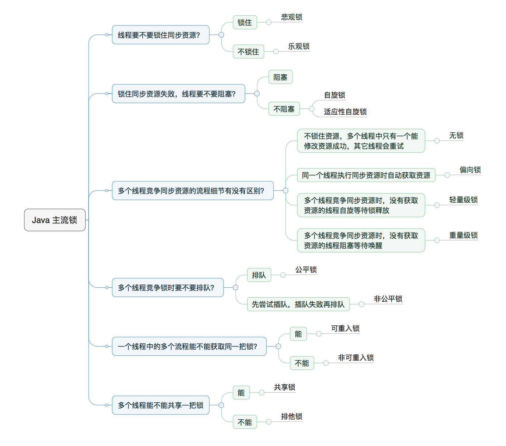

## 同步和异步
    异步的使用场景：

        1、不涉及共享资源，或对共享资源只读，即非互斥操作

        2、没有时序上的严格关系

        3、不需要原子操作(一个不会被线程中断机制所打断的操作)，或可以通过其他方式控制原子性

        4、常用于IO操作等耗时操作，因为比较影响客户体验和使用性能

        5、不影响主线程逻辑

    同步的使用场景：不使用异步的时候

    同步的好处：

        1、同步流程对结果处理通常更为简单，可以就近处理。

        2、同步流程对结果的处理始终和前文保持在一个上下文内。

        3、同步流程可以很容易捕获、处理异常。

        4、同步流程是最天然的控制过程顺序执行的方式。

 

    异步的好处：

        1、异步流程可以立即给调用方返回初步的结果。

        2、异步流程可以延迟给调用方最终的结果数据，在此期间可以做更多额外的工作，例如结果记录等等。

        3、异步流程在执行的过程中，可以释放占用的线程等资源，避免阻塞，等到结果产生再重新获取线程处理。

        4、异步流程可以等多次调用的结果出来后，再统一返回一次结果集合，提高响应效率。
## java语言的同步机制:
    同步方法和同步静态代码块，同步类,通过syschronize关键字实现
## java异步机制：
    可以通过start调用run方法来实现
    同步异步区别：
        银行办理业务时：
            一个窗口多个人等待是为同步
            多个窗口办理业务是为异步
## 线程的生命周期：
    新建----->就绪----->运行----->死亡 以及阻塞状态
## 创建线程的三种方式：
    通过Thread创建
    通过实现runnable接口创建
    通过实现callable接口创建
# 锁的种类

## CAS算法
    CAS全称为compare and swap 是并发编程常用的算法
        可以用来实现无锁式同步机制
        CAS一共有三个值：V（实际读取位置的值），A（旧的预期值），B（线程方法的执行结果（新值））
        主要用途是用来使用不加锁的方式来实现同步
            可以满足多个线程访问同一个资源
        当一个线程访问一个位置的资源时，访问它的数据并执行自己的方法，在执行完方法后，将之前获取到的数据值和如今位置的数值进行比较，相同证明当前没有其他线程更新过该数据，将返回值写入到该位置，若不相同则证明有其他线程访问该线程，则将如今的数据取出执行上一个操作，一直循环直到数值相同为止
    
    CAS指令执行时，当且仅当V的值等于预期值A时，才会将V的值设为B，如果V和A不同，说明可能是其他线程做了更新，那么当前线程就什么都不做，最后，CAS返回的是V的真实值。
    而在多线程的情况下，当多个线程同时使用CAS操作一个变量时，只有一个会成功并更新值，其余线程均会失败，但失败的线程不会被挂起，而是不断的再次循环重试。
    
    正是基于这样的原理，CAS即时没有使用锁，也能发现其他线程对当前线程的干扰，从而进行及时的处理。
    
    CAS的应用类
        Java中提供了一系列应用CAS操作的类，这些类位于java.util.concurrent.atomic包下，其中最常用的就是AtomicInteger，该类可以看做是实现了CAS操作的Integer

    可能会出现ABA问题：
        其他线程修改数次之后的值和原来的值相同
    解决方案：
        添加版本号以予以区分
## ASQ算法
        
## 公平锁和非公平锁
    公平锁是指按照申请锁的先后顺序来获取锁
    非公平锁是按照线程的优先级来获取锁的
        在java中syschronized关键字是非公平锁和ReetrantLock关键字默认是非公平锁
### 公平锁的创建方法：
        创建一个可重入锁
            true代表是公平锁，false代表是非公平锁
    /**
* 创建一个可重入锁，true 表示公平锁，false 表示非公平锁。默认非公平锁
*/
Lock lock = new ReentrantLock(true);
## 可重入锁
    可重入锁又称为递归锁：是指同一个线程在外层方法获取锁之后，会自动获取锁，一个线程的多个流程可以获得同一把锁
    
    好处：一定程度上可以避免死锁的发生
## 自旋锁
    自旋锁指没有获取到锁时，不是直接挂起，而是进入忙循环（自旋状态）
    因为挂起和唤醒也会消耗时间，减少被挂起的概率
    当一个锁被长时间占用后，最终还是会被挂起，因而此时忙循环会变成造成资源吧被浪费的操作
    因而自旋锁不适用于锁被长时间占用的并发操作
~~~~java
    automicInteger类也存在自旋操作
    public final int getAndAddInt(Object o, long offset, int delta) {
    int v;
    do {
        v = getIntVolatile(o, offset);
    } while (!compareAndSwapInt(o, offset, v, v + delta));
    return v;
}
~~~~
### 自适应自旋锁
    自适应自旋，这个就比较智能了，自旋时间不再固定，由前一次在同一个锁上的自旋时间以及锁的拥有者的状态来决定。如果虚拟机认为这次自旋也很有可能再次成功那就会持续较多的时间，如果自旋很少成功，那以后可能就直接省略掉自旋过程，避免浪费处理器资源。
## 分段锁
    分段锁是一种锁的设计方式
    1.